<p align="center">
  
  
  
  
  
  
  
  
</p>

# HirePrep AI

**An AI-powered career platform that transforms resumes into actionable strategy with live interactive mock interviews, real-time biometric analysis, audio coaching, and dynamic study roadmaps using Google Gemini.**

HirePrep AI is a full-stack interview preparation platform designed to help candidates bridge the gap between their current profile and their target job roles. By leveraging Large Language Models (LLMs) and real-time voice synthesis, the platform provides personalized roadmaps, deep resume analysis, and interactive mock interview sessions with biometric feedback.

---

## Table of Contents

- [Core Features](#core-features)
- [Tech Stack](#tech-stack)
- [Monorepo Structure](#monorepo-structure)
- [Architecture Overview](#architecture-overview)
  - [High-Level Component Interaction](#high-level-component-interaction)
  - [Main User Journey](#main-user-journey)
  - [Entity Mapping: Features to Code](#entity-mapping-features-to-code)
- [Getting Started & Environment Setup](#getting-started--environment-setup)
  - [Prerequisites](#prerequisites)
  - [Repository Setup](#repository-setup)
  - [Environment Configuration](#environment-configuration)
  - [Running Locally](#running-locally)
  - [Docker Compose Setup](#docker-compose-setup)
- [Deployment & Containerization](#deployment--containerization)
  - [Backend Containerization (Docker)](#backend-containerization-docker)
  - [Service Topology (Docker Compose)](#service-topology-docker-compose)
  - [Frontend Deployment (Vercel)](#frontend-deployment-vercel)
  - [Deployment Checklist](#deployment-checklist)
- [Backend Architecture](#backend-architecture)
  - [Server Bootstrap & Middleware](#server-bootstrap--middleware)
  - [Express Middleware Stack](#express-middleware-stack)
  - [Routing Domains](#routing-domains)
- [Data Models & Database](#data-models--database)
  - [User Model](#user-model)
  - [InterviewReport Model](#interviewreport-model)
  - [InterviewSession Model](#interviewsession-model)
  - [Indexing & Performance](#indexing--performance)
- [Authentication System](#authentication-system)
  - [Registration & Identity Management](#registration--identity-management)
  - [Login & Session Issuance](#login--session-issuance)
  - [The authUser Middleware](#the-authuser-middleware)
  - [Logout & Redis Blacklisting](#logout--redis-blacklisting)
  - [Security Middleware](#security-middleware)
- [Interview & Job API Routes](#interview--job-api-routes)
  - [Interview API](#interview-api-apiinterview)
  - [Job API](#job-api-apijobs)
  - [Rate Limiter Configuration](#rate-limiter-configuration)
- [AI Service Layer](#ai-service-layer)
  - [Resume Analysis & Report Generation](#resume-analysis--report-generation)
  - [Live Interview AI Features](#live-interview-ai-features)
  - [PDF Resume Generation Pipeline](#pdf-resume-generation-pipeline)
  - [Job Search Service](#job-search-service)
  - [Dynamic Roadmap Generation](#dynamic-roadmap-generation)
- [Frontend Architecture](#frontend-architecture)
  - [Routing & Application Shell](#routing--application-shell)
  - [Authentication Feature (Frontend)](#authentication-feature-frontend)
  - [Interview Feature — Pages & State](#interview-feature--pages--state)
  - [Live Interview Engine (Frontend)](#live-interview-engine-frontend)
  - [Face Analysis & ML Models](#face-analysis--ml-models)
  - [Styling System](#styling-system)
- [Caching, Rate Limiting & Security](#caching-rate-limiting--security)
  - [Redis Infrastructure](#redis-infrastructure)
  - [JWT Authentication & Token Lifecycle](#jwt-authentication--token-lifecycle)
  - [CORS & Network Security](#cors--network-security)
- [Glossary](#glossary)

---

## Core Features

- **Deep Resume Analysis** — Maps career history to job requirements to identify strong suits and skill gaps.
- **AI Job Matcher** — Cross-references user profiles with live job boards via external APIs (JSearch / RapidAPI).
- **Live Voice Interviews** — Real-time, voice-enabled mock interviews with instant conversational feedback using the Web Speech API.
- **Biometric Feedback** — Real-time analysis of eye contact and facial expressions during interviews using `face-api.js` (TensorFlow.js).
- **Instant Roadmaps** — Generates day-by-day preparation plans using Google Gemini, customizable to any duration.
- **ATS-Optimized Resumes** — Generates tailored PDF resumes rewritten specifically for target roles via Puppeteer rendering.
- **Real-time Coaching** — Per-answer feedback during live interview sessions with an AI "interview coach."
- **AI Copilot (Hints)** — Real-time strategic hints during live interviews without giving away the full answer.

---

## Tech Stack

| Layer | Technology | Key Code Entities |
| :--- | :--- | :--- |
| **Frontend** | React 19, Vite, SCSS | `AuthProvider`, `InterviewProvider`, `useSpeech`, `useFaceAnalysis` |
| **Backend** | Node.js, Express | `server.js`, `app.js`, `interview.controller.js` |
| **Database** | MongoDB (Mongoose ODM) | `User`, `InterviewReport`, `InterviewSession` |
| **Caching** | Redis | `redis.js`, `rateLimiter`, `RedisStore` |
| **AI / ML** | Google Gemini (`gemini-2.5-flash-lite`), face-api.js | `ai.service.js`, `useFaceAnalysis.js` |
| **PDF Generation** | Puppeteer | `globalBrowser`, `renderHtmlToPdf` |
| **File Uploads** | Multer (in-memory) | `file.middleware.js` |
| **Containerization** | Docker, Docker Compose | `Dockerfile`, `docker-compose.yml` |
| **Frontend Hosting** | Vercel | `vercel.json` |

---

## Monorepo Structure

```
HirePrep-AI/
├── Backend/
│   ├── server.js                    # Entry point — bootstrap sequence
│   ├── Dockerfile                   # Production container with Chromium
│   ├── docker-compose.yml           # Backend + Redis sidecar
│   ├── package.json
│   └── src/
│       ├── app.js                   # Express app, middleware pipeline
│       ├── config/
│       │   ├── database.js          # MongoDB connection (Mongoose)
│       │   └── redis.js             # Redis client with reconnect strategy
│       ├── controllers/
│       │   ├── auth.controller.js   # Register, login, logout, session
│       │   ├── interview.controller.js  # Report generation, live Q&A, roadmap
│       │   └── job.controller.js    # Job search orchestration
│       ├── middlewares/
│       │   ├── auth.middleware.js    # JWT verification + Redis blacklist
│       │   └── file.middleware.js   # Multer PDF upload (5 MB limit)
│       ├── models/
│       │   ├── user.model.js        # User schema (username, email, password)
│       │   ├── interviewReport.model.js  # Report with nested sub-schemas
│       │   └── interviewSession.model.js # Live session transcript + biometrics
│       ├── routes/
│       │   ├── auth.routes.js       # /api/auth — rate-limited
│       │   ├── interview.routes.js  # /api/interview — AI rate-limited
│       │   └── job.routes.js        # /api/jobs — authenticated
│       └── services/
│           ├── ai.service.js        # Gemini integration, Zod schemas, caching
│           └── job.service.js       # JSearch RapidAPI integration
├── Frontend/
│   ├── index.html
│   ├── vercel.json                  # Vercel deployment config
│   ├── vite.config.js
│   ├── package.json
│   ├── public/
│   │   └── models/                  # face-api.js TensorFlow.js model weights
│   └── src/
│       ├── main.jsx                 # React entry point
│       ├── App.jsx                  # Provider tree (Auth → Interview → Router)
│       ├── app.routes.jsx           # Route definitions + ProtectedRoute
│       ├── style.scss               # Global glassmorphism design system
│       ├── style/
│       │   └── button.scss          # Global button styles
│       └── features/
│           ├── auth/
│           │   ├── auth.context.jsx     # Authentication state management
│           │   ├── auth.form.scss       # Auth form styles
│           │   ├── components/
│           │   │   └── Protected.jsx    # Route protection wrapper (HOC)
│           │   ├── hooks/
│           │   │   └── useAuth.js       # Auth hook (login, register, logout)
│           │   ├── pages/               # Login.jsx, Register.jsx
│           │   └── services/auth.api.js # Auth API client (Axios)
│           ├── interview/
│           │   ├── interview.context.jsx    # Interview state management
│           │   ├── hooks/
│           │   │   ├── useInterview.js      # Report generation & retrieval
│           │   │   ├── useSpeech.js         # Web Speech API (TTS + STT)
│           │   │   └── useFaceAnalysis.js   # face-api.js biometric analysis
│           │   ├── pages/
│           │   │   ├── Home.jsx             # Dashboard — upload resume + JD
│           │   │   ├── Interview.jsx        # Report detail — tabs view
│           │   │   ├── LiveInterview.jsx    # Voice-enabled mock interview
│           │   │   └── MockHistory.jsx      # Past session analytics
│           │   ├── services/interview.api.js # Interview API client (Axios)
│           │   └── style/                   # SCSS modules
│           └── public/
│               ├── pages/Landing.jsx   # Public landing page
│               └── style/landing.scss  # Landing page styles
└── README.md
```

---

## Architecture Overview

### High-Level Component Interaction

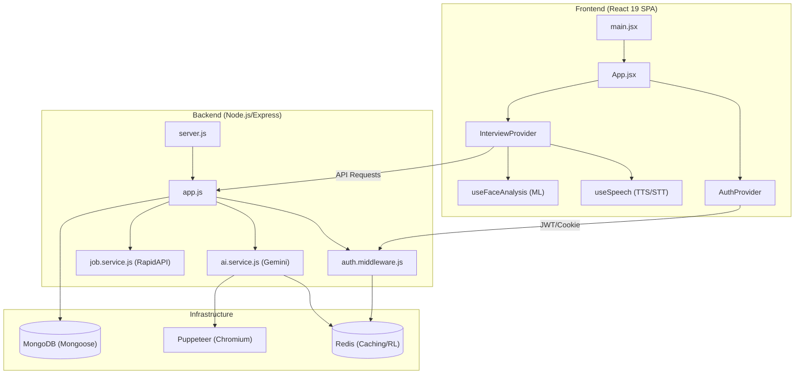

### Main User Journey

1. **Upload & Target** — The user provides a resume (PDF) and a target Job Description.
2. **Action Plan** — The system generates a match score, skill gap analysis, and a tailored Q&A roadmap.
3. **Resume Export** — Users can download an AI-optimized resume PDF generated via Puppeteer.
4. **Live Practice** — Engagement in a voice-enabled interview session with real-time biometric feedback.

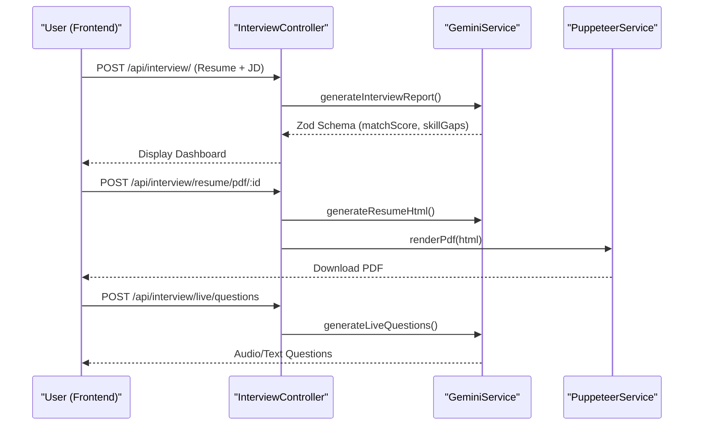

### Entity Mapping: Features to Code

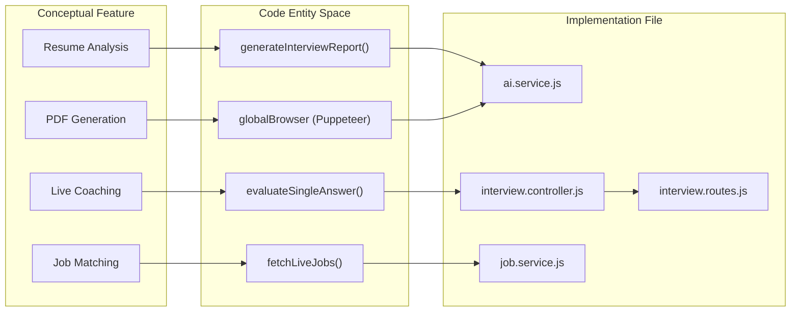

---

## Getting Started & Environment Setup

### Prerequisites

- **Node.js** — Version 20 or higher
- **MongoDB** — A local instance or a MongoDB Atlas connection string
- **Redis** — Required for rate limiting, JWT blacklisting, and AI response caching
- **Google Gemini API Key** — For AI generation features
- **RapidAPI Key** — For the JSearch job search integration
- **Docker & Docker Compose** — (Optional) For containerized execution

### Repository Setup

```bash
git clone https://github.com/harshitzofficial/-HirePrep-AI.git
cd -HirePrep-AI

# Install Backend dependencies
cd Backend
npm install

# Install Frontend dependencies
cd ../Frontend
npm install
```

### Environment Configuration

#### Backend `.env`

Create `Backend/.env` with the following variables:

```env
PORT=3000
MONGO_URI=your_mongodb_connection_string
REDIS_URL=redis://localhost:6379
JWT_SECRET=your_super_secret_key
GOOGLE_GENAI_API_KEY=your_google_gemini_api_key
RAPIDAPI_KEY=your_jsearch_rapidapi_key
FRONTEND_URL=http://localhost:5173
NODE_ENV=development
```

| Variable | Description |
| :--- | :--- |
| `MONGO_URI` | MongoDB connection string for storing users and interview reports. |
| `REDIS_URL` | Redis connection URL (e.g., `redis://localhost:6379`). |
| `GOOGLE_GENAI_API_KEY` | API key for Google Gemini (`gemini-2.5-flash-lite`). |
| `RAPIDAPI_KEY` | Key for JSearch API via RapidAPI. |
| `JWT_SECRET` | Secret string used for signing authentication tokens. |
| `FRONTEND_URL` | The URL of the running frontend (e.g., `http://localhost:5173`). |
| `PORT` | Port for the backend server (defaults to `3000`). |

#### Frontend `.env`

Create `Frontend/.env`:

| Variable | Description |
| :--- | :--- |
| `VITE_API_URL` | The base URL of the backend server (e.g., `http://localhost:3000`). |

### Running Locally

#### Starting the Backend

```bash
cd Backend
npm run dev
```

The server initializes:
1. Connects to **MongoDB** via `mongoose`.
2. Initializes the `redisClient` with a reconnect strategy.
3. Starts the Express application on the defined `PORT`.

#### Starting the Frontend

```bash
cd Frontend
npm run dev
```

The application will be available at `http://localhost:5173`.

#### Local Development Architecture

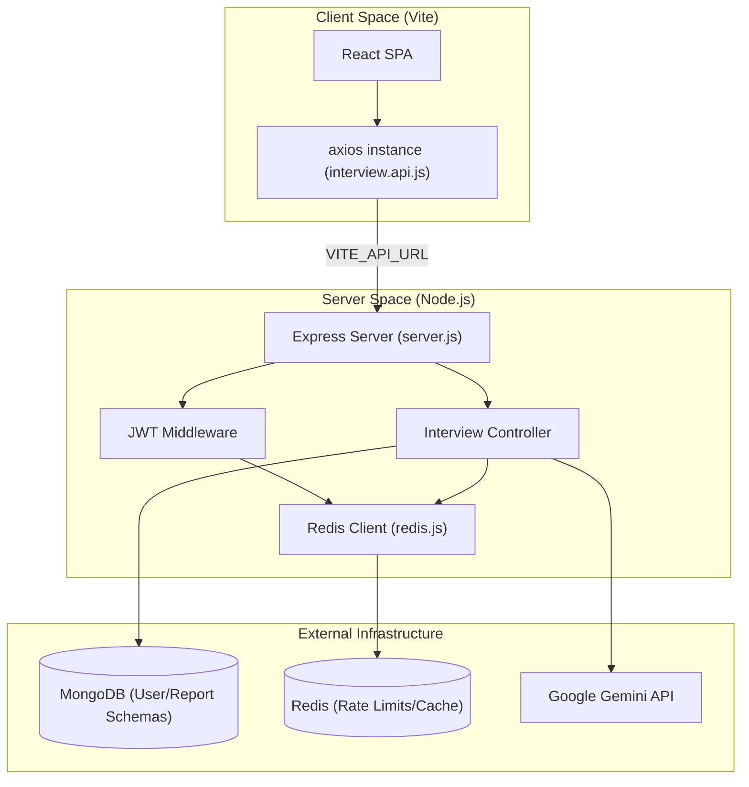

### Docker Compose Setup

```bash
cd Backend
docker-compose up --build
```

| Service | Image | Responsibility |
| :--- | :--- | :--- |
| `backend` | Custom (via `Dockerfile`) | Express API, Puppeteer Rendering, AI Orchestration |
| `redis` | `redis:alpine` | Caching, Rate Limiting, Session Blacklist |

---

## Deployment & Containerization

### Backend Containerization (Docker)

| Layer Category | Implementation Detail | Purpose |
| :--- | :--- | :--- |
| **Base Image** | `node:22-alpine` | Lightweight Node.js environment. |
| **System Deps** | `chromium`, `nss`, `freetype`, `harfbuzz`, `ttf-freefont` | Required for Puppeteer to render HTML to PDF. |
| **Puppeteer Config** | `PUPPETEER_SKIP_DOWNLOAD=true` | Prevents downloading bundled Chrome to save space. |
| **Binary Path** | `PUPPETEER_EXECUTABLE_PATH=/usr/bin/chromium-browser` | Points Puppeteer to the Alpine-installed Chromium. |
| **Security** | `USER node` | Switches from root to a low-privileged user. |
| **Optimization** | `npm ci --omit=dev` | Installs only production dependencies. |

### Service Topology (Docker Compose)

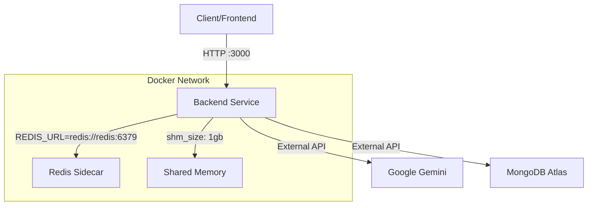

**Key Configuration:**
- **Shared Memory (`shm_size`)**: Set to `1gb` — critical for Chromium, which uses `/dev/shm` for memory sharing; the default Docker limit (64MB) often causes Puppeteer to crash.
- **Volume Mapping**: Local directory mapped to `/usr/src/app` for hot-reloading; `node_modules` preserved in a named volume.
- **Environment Integration**: The `env_file` directive pulls sensitive keys into the container.

### Frontend Deployment (Vercel)

- **Build Command**: `npm run build`
- **Output Directory**: `dist`
- **Environment**: Must set `VITE_API_URL` to point to the deployed backend URL.

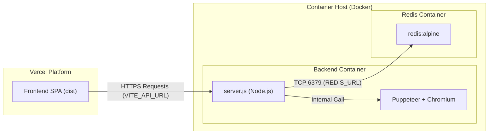

### Deployment Checklist

| Component | Platform | Key Requirement |
| :--- | :--- | :--- |
| **Backend** | Docker / VPS | Must support `shm_size` configuration for Puppeteer. |
| **Redis** | Docker / Managed | Required for rate limiting and AI response caching. |
| **Frontend** | Vercel / Netlify | Must set `VITE_API_URL` to the Backend endpoint. |
| **Database** | MongoDB Atlas | Accessible via `MONGO_URI` from the Backend container. |

#### Environment Differences

| Variable | Local Development | Production (Docker/Vercel) |
| :--- | :--- | :--- |
| `REDIS_URL` | `redis://localhost:6379` | `redis://redis:6379` (Docker internal) |
| `NODE_ENV` | `development` | `production` |
| `PUPPETEER_EXECUTABLE_PATH` | Not required (uses local) | `/usr/bin/chromium-browser` |
| `VITE_API_URL` | `http://localhost:3000` | Deployed Backend URL |

---

## Backend Architecture

### Server Bootstrap & Middleware

The server initialization follows a strict "Infrastructure-First" boot sequence defined in `server.js`:

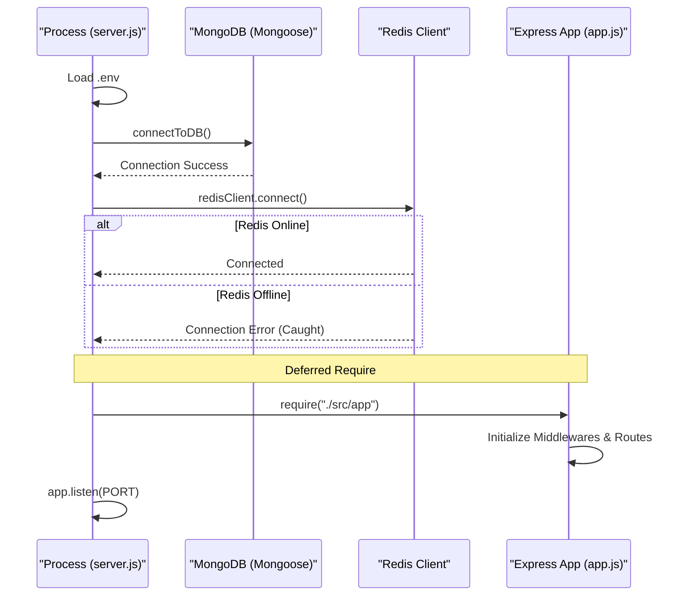

1. **Environment Loading** — Loads variables from `.env` via `dotenv`.
2. **Database Initialization** — Calls `connectToDB()` to establish a Mongoose connection.
3. **Cache Initialization** — Calls `redisClient.connect()`. If it fails, the system catches the error and proceeds (rate limiters fall back to in-memory storage).
4. **Deferred App Loading** — The Express `app` is required **after** database connections are established.
5. **Port Binding** — The server begins listening on the configured `PORT`.

### Express Middleware Stack

| Middleware | Functionality |
| :--- | :--- |
| **Manual CORS** | Validates `req.headers.origin` against `FRONTEND_URL`, sets `Access-Control-Allow-Credentials`, handles `OPTIONS` preflight. |
| **Trust Proxy** | Configured to `1` for correct client IP detection behind load balancers. |
| **JSON Parser** | Standard `express.json()` for parsing request bodies. |
| **Cookie Parser** | Enables extraction of JWTs from `httpOnly` cookies. |

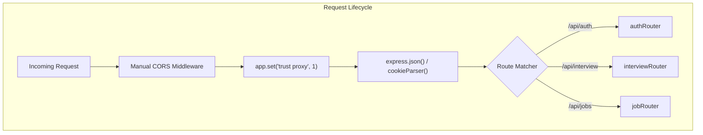

### Routing Domains

- **Authentication (`/api/auth`):** User lifecycle — registration, login, secure logout with Redis-backed token invalidation.
- **Interview Engine (`/api/interview`):** Resume parsing, AI report generation, live interview session tracking.
- **Job Services (`/api/jobs`):** AI-driven job recommendations based on analyzed resume skills.

---

## Data Models & Database

The persistence layer utilizes MongoDB via the Mongoose ODM. The system is designed around three primary entities.

### Entity Relationship Diagram

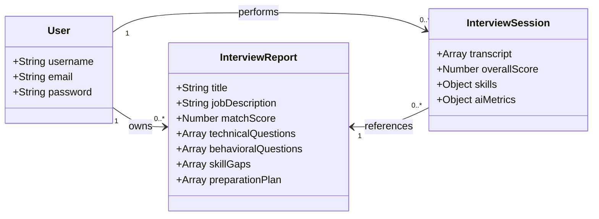

### User Model

The `userModel` manages identity and authentication:

| Field | Type | Constraints | Description |
| :--- | :--- | :--- | :--- |
| `username` | `String` | `required`, `unique` | Unique identifier chosen by the user |
| `email` | `String` | `required`, `unique` | Used for login and identification |
| `password` | `String` | `required` | Hashed representation (bcrypt, 10 salt rounds) |

### InterviewReport Model

The `interviewReportModel` stores AI-driven resume and job description analysis using nested sub-schemas:

| Sub-Schema | Fields | Description |
| :--- | :--- | :--- |
| `technicalQuestionSchema` | `question`, `intention`, `answer` | AI-generated technical questions |
| `behavioralQuestionSchema` | `question`, `intention`, `answer` | Behavioral assessment questions |
| `skillGapSchema` | `skill`, `severity` (low/medium/high) | Identified skill gaps |
| `preparationPlanSchema` | `day`, `focus`, `tasks` | Day-by-day roadmap |

### InterviewSession Model

The `interviewSessionModel` captures the results of a live mock interview, including biometric data:

| Field | Type | Description |
| :--- | :--- | :--- |
| `transcript` | `Array<Object>` | Array of `{ question, answer, feedback }` for each turn |
| `overallScore` | `Number` | 0-10 holistic score from AI evaluation |
| `skills` | `Object` | Scores for `confidence`, `communication`, `correctness` |
| `aiMetrics` | `Object` | Biometric data: `avgConfidence`, `eyeContactScore` |
| `user` | `ObjectId` | Reference to the `users` collection |
| `interviewReport` | `ObjectId` | Reference to the parent `InterviewReport` |

### Data Entity Lifecycle

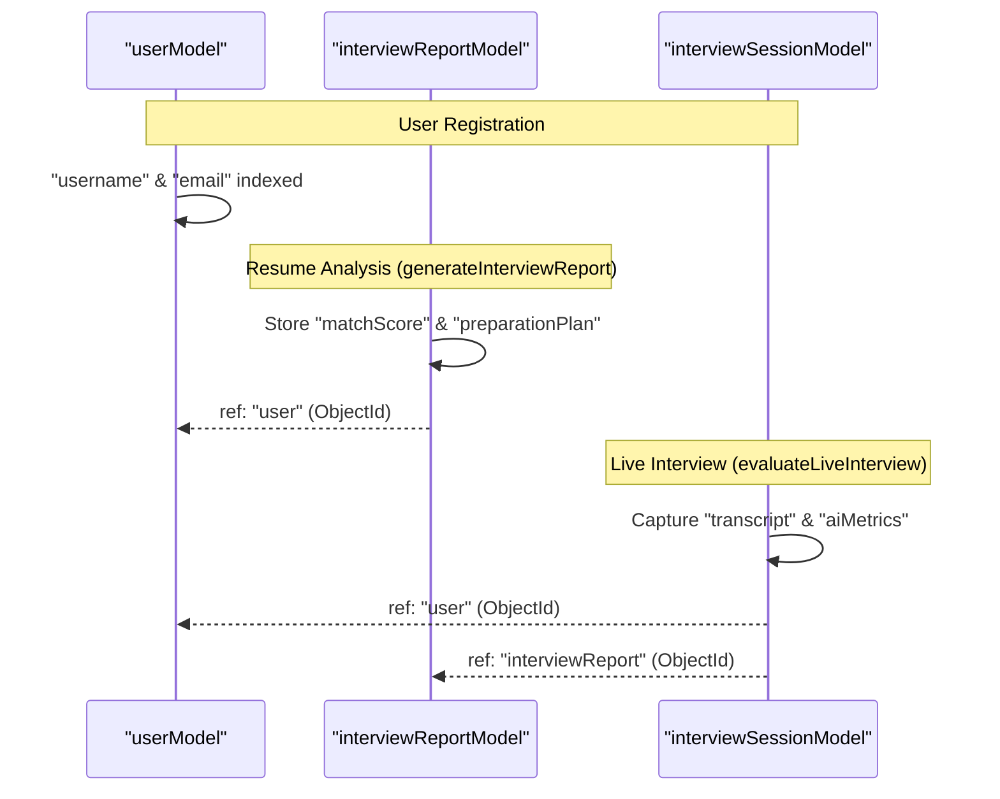

### Indexing & Performance

1. **Unique Indexes**: Automatically created for `User.username` and `User.email` to prevent duplicates and speed up authentication queries.
2. **Foreign Key References**: Uses `mongoose.Schema.Types.ObjectId` with `ref` to enable `populate()` calls.
3. **Timestamps**: Both `InterviewReport` and `InterviewSession` utilize `{ timestamps: true }` to automatically manage `createdAt` and `updatedAt` fields.

---

## Authentication System

### Registration & Identity Management

User registration is handled by `registerUserController`. It enforces data integrity by checking for required fields and validating a minimum password length of 8 characters.

**Registration Data Flow:**
1. **Request**: Client sends `username`, `email`, and `password`.
2. **Validation**: `authRateLimiter` checks IP quota.
3. **Uniqueness**: `userModel.findOne` checks for duplicates using `$or` operator.
4. **Hashing**: `bcrypt.hash` generates a secure string (10 salt rounds).
5. **Persistence**: `userModel.create` saves the user.
6. **Token Issuance**: A JWT is signed and set as an `httpOnly` cookie.

### Login & Session Issuance

The `loginUserController` authenticates users by comparing credentials against hashed values using `bcrypt.compare`.

**JWT Configuration:**
- **Payload**: Contains `id` (MongoDB `_id`) and `username`.
- **Expiry**: Set to `1d` (24 hours).
- **Secret**: Read from `process.env.JWT_SECRET`.

**Cookie Configuration:**

| Property | Value | Purpose |
| :--- | :--- | :--- |
| `httpOnly` | `true` | Prevents JavaScript access (XSS protection) |
| `secure` | `true` | Cookie only sent over HTTPS |
| `sameSite` | `"None"` | Required for cross-domain cookies (e.g., Vercel frontend → Render backend) |
| `maxAge` | `86400000` (24h) | Matches JWT expiry |

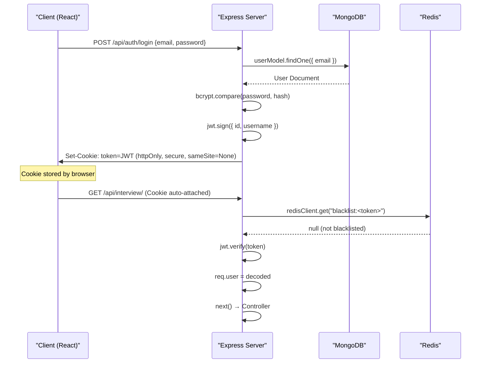

### The authUser Middleware

The `authUser` middleware in `auth.middleware.js` is the central gatekeeper for all protected routes. It performs a two-step verification:

1. **Token Extraction**: Checks `req.cookies.token` first, then falls back to `Authorization: Bearer <token>` header.
2. **Redis Blacklist Check**: Queries Redis for `blacklist:<token>`. If found, the token has been invalidated via logout.
3. **JWT Verification**: Calls `jwt.verify()` to validate signature and expiry.
4. **Payload Injection**: Attaches the decoded payload (`id`, `username`) to `req.user`.

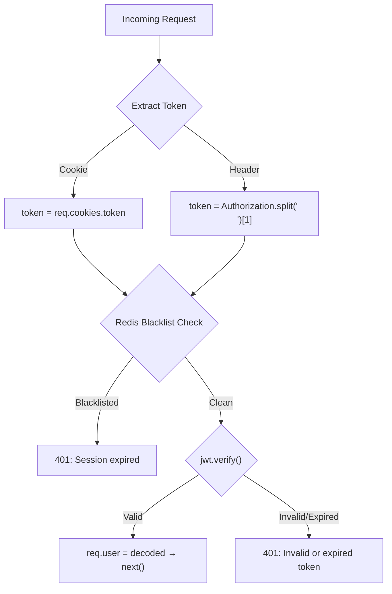

### Logout & Redis Blacklisting

The `logoutUserController` implements a secure token invalidation strategy using Redis TTL-based blacklisting:

1. **Decode Token**: Extracts the token's `exp` (expiration) claim.
2. **Calculate TTL**: Computes `timeLeft = exp - currentTime` (seconds until natural expiry).
3. **Redis Blacklist**: Stores `blacklist:<token>` with `setEx` using the calculated TTL — the entry self-destructs when the token would have expired anyway.
4. **Clear Cookie**: Removes the `token` cookie from the browser.

This approach ensures:
- Logged-out tokens are immediately rejected by `authUser`.
- Redis memory is automatically reclaimed (no manual cleanup needed).
- Even if Redis is temporarily down, the cookie is still cleared.

### Security Middleware

| Middleware | Applied To | Configuration |
| :--- | :--- | :--- |
| `authRateLimiter` | `/api/auth/register`, `/api/auth/login` | 20 requests per 15 minutes per IP. Falls back to `MemoryStore` if Redis is down. |
| `authUser` | All `/api/interview/*` and `/api/jobs/*` routes | JWT + Redis blacklist verification. |
| `handleResumeUpload` | `POST /api/interview/` | Multer wrapper — catches file size (5MB) and type (PDF only) errors. |

---

## Interview & Job API Routes

### Interview API (`/api/interview`)

All interview routes require `authUser` middleware. AI-intensive routes additionally use `aiRateLimiter`.

| Method | Route | Rate Limited | Controller | Description |
| :--- | :--- | :--- | :--- | :--- |
| `POST` | `/` | Yes | `generateInterViewReportController` | Upload resume (PDF) + JD → AI report |
| `GET` | `/` | No | `getAllInterviewReportsController` | List all reports for logged-in user |
| `GET` | `/report/:interviewId` | No | `getInterviewReportByIdController` | Fetch single report by ID |
| `DELETE` | `/report/:interviewId` | No | `deleteInterviewReportController` | Delete report (owner only) |
| `POST` | `/resume/pdf/:interviewReportId` | Yes | `generateResumePdfController` | Generate ATS-optimized PDF resume |
| `POST` | `/live/questions` | Yes | `getLiveQuestionsController` | Generate 3 live interview questions |
| `POST` | `/live/evaluate` | Yes | `evaluateInterviewController` | Grade full interview transcript |
| `POST` | `/live/evaluate-single` | Yes | `evaluateSingleAnswerController` | Grade a single Q&A pair (instant coaching) |
| `POST` | `/live/hint` | Yes | `getLiveHintController` | Get AI Copilot hint for current question |
| `POST` | `/roadmap/dynamic` | Yes | `generateDynamicRoadmapController` | Generate N-day preparation roadmap |
| `GET` | `/sessions` | No | `getAllInterviewSessionsController` | Fetch all past mock interview sessions |

### Job API (`/api/jobs`)

| Method | Route | Rate Limited | Controller | Description |
| :--- | :--- | :--- | :--- | :--- |
| `GET` | `/search?location=...` | Yes | `searchJobsController` | AI-powered job search using resume skills |

**Job Search Flow:**
1. Fetches the user's latest `InterviewReport` to extract resume text.
2. Calls `getJobSearchQueryFromResume()` — Gemini extracts a single job title from the resume.
3. Checks Redis cache (`jobs:<query>:<location>`, TTL: 6 hours).
4. On cache miss, calls `fetchLiveJobs()` via JSearch/RapidAPI.

### Rate Limiter Configuration

| Limiter | Window | Max Requests | Backing Store | Applied To |
| :--- | :--- | :--- | :--- | :--- |
| `authRateLimiter` | 15 minutes | 20 | Redis (fallback: Memory) | `/api/auth/register`, `/api/auth/login` |
| `aiRateLimiter` | 15 minutes | 10 | Redis (`RedisStore`) | All AI-generation interview routes |
| `jobRateLimiter` | 15 minutes | 20 | Redis (`RedisStore`) | `/api/jobs/search` |

All rate limiters use `express-rate-limit` with `rate-limit-redis` (`RedisStore`) for distributed state. They set `standardHeaders: true` and `legacyHeaders: false`.

---

## AI Service Layer

The AI service layer (`ai.service.js`) is the core intelligence engine. It uses Google Gemini (`gemini-2.5-flash-lite`) with Zod schema validation to ensure structured, type-safe AI responses.

### Core Infrastructure

- **Model**: `gemini-2.5-flash-lite` (configured as `MODEL_NAME` constant).
- **Retry Logic**: `callAiWithRetry()` implements exponential backoff (up to 3 retries) for 429/quota errors.
- **Cache Key Generation**: `generateCacheKey()` creates SHA-256 hashes of input combinations for Redis caching.
- **Schema Validation**: All AI responses are constrained by Zod schemas converted to JSON Schema via `zodToJsonSchema`.

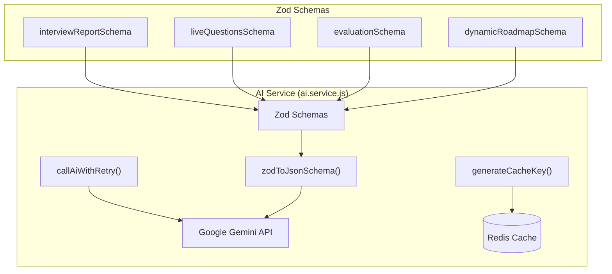

### Resume Analysis & Report Generation

`generateInterviewReport({ resume, selfDescription, jobDescription })` — The primary analysis function.

**Prompt Strategy**: Acts as a "Senior Technical Recruiter" to extract skills, projects, match score, questions, skill gaps, and a preparation plan.

**Output Schema** (`interviewReportSchema`):
- `matchScore` (0-100), `detectedSkills`, `identifiedProjects`
- `technicalQuestions` / `behavioralQuestions` (each with `question`, `intention`, `answer`)
- `skillGaps` (with `severity`: low/medium/high)
- `preparationPlan` (day-by-day with `focus` and `tasks`)
- `title` (extracted job title)

**Caching**: The controller (`generateInterViewReportController`) caches the full report in Redis with a 24-hour TTL using a SHA-256 hash of `userId + resumeText + jobDescription + selfDescription`.

### Live Interview AI Features

| Function | Purpose | Output |
| :--- | :--- | :--- |
| `generateLiveQuestions()` | Generates exactly 3 interview questions based on resume, JD, and interview type (Technical/Behavioral/System Design/Mixed) | `{ questions: string[3] }` |
| `evaluateLiveInterview()` | Grades the full transcript with biometric data (`avgConfidence`, `eyeContactScore`) | `{ overallScore, summary, skills, questionBreakdown }` |
| `evaluateSingleAnswer()` | Provides instant per-answer coaching (3-4 sentences) | `{ feedback: string }` |
| `generateLiveHint()` | Returns a 1-sentence AI Copilot hint without revealing the answer | `{ hint: string }` |

**Graceful Degradation**: `generateLiveQuestions()` and `evaluateLiveInterview()` return hardcoded fallback responses when the Gemini API returns 429 errors, ensuring the user experience is never completely broken.

### PDF Resume Generation Pipeline

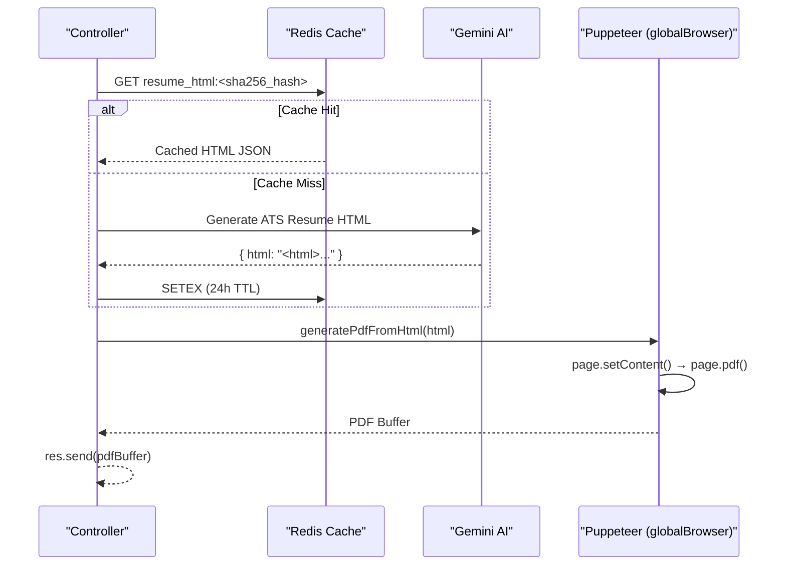

**Key Design Decisions:**
- **Singleton Browser**: `globalBrowser` reuses a single Puppeteer instance across all requests (launching Chromium is expensive).
- **HTML Caching, Not PDF Caching**: Redis caches the AI-generated HTML (small text), not the PDF binary (large blob). Puppeteer rendering is fast (~1s) and free; Gemini calls are slow (~10s) and cost money.
- **Platform-Aware Executable Path**: `getBrowser()` checks `PUPPETEER_EXECUTABLE_PATH` env var first, then falls back to `/usr/bin/chromium-browser` only on Linux.

### Job Search Service

`job.service.js` provides two functions:

1. **`getJobSearchQueryFromResume(resumeText)`** — Uses Gemini to extract a single job title from resume text (e.g., "React Developer"). Falls back to "Software Engineer" on error.
2. **`fetchLiveJobs(searchQuery, location)`** — Calls the JSearch API via RapidAPI with the extracted query and user-provided location. Returns up to ~10 results.

**Caching**: Job results are cached in Redis for 6 hours (`jobs:<query>:<location>` key pattern).

### Dynamic Roadmap Generation

`generateDynamicRoadmap({ jobDescription, resumeText, days })` — Generates a custom N-day preparation roadmap.

- Uses `dynamicRoadmapSchema` (Zod) to enforce structured output.
- Day 1 focuses on fundamentals/planning; Day N focuses on mock interviews/rest.
- Called via `POST /api/interview/roadmap/dynamic`.

---

## Frontend Architecture

The frontend is a React 19 Single Page Application built with Vite, organized using a feature-based architecture.

### Routing & Application Shell

**Provider Hierarchy** (`App.jsx`):

```
<AuthProvider>          ← manages user login state
  <InterviewProvider>   ← manages interview-related data
    <RouterProvider>    ← loads pages based on URL
```

**Route Definitions** (`app.routes.jsx`):

| Path | Component | Protected | Description |
| :--- | :--- | :--- | :--- |
| `/` | `Landing` | No | Public landing page |
| `/login` | `Login` | No | Login form |
| `/register` | `Register` | No | Registration form |
| `/dashboard` | `Home` | Yes | Upload resume + JD, view reports |
| `/interview/:interviewId` | `Interview` | Yes | Report detail with tabs |
| `/interview/:interviewId/live` | `LiveInterview` | Yes | Voice-enabled mock interview |
| `/history` | `MockHistory` | Yes | Past session analytics |
| `*` | `Navigate to /` | — | Catch-all redirect |

### Authentication Feature (Frontend)

**State Management** (`auth.context.jsx`):
- `AuthContext` provides `user`, `setUser`, `loading`, `setLoading`.
- `AuthProvider` wraps the entire app.

**Hook** (`useAuth.js`):
- `handleLogin({ email, password })` — Calls API, sets user state.
- `handleRegister({ username, email, password })` — Calls API, sets user state.
- `handleLogout()` — Calls API, clears user state.
- **Auto-session restore**: On mount, calls `getMe()` to restore session from the `httpOnly` cookie.

**Route Protection** (`Protected.jsx`):
- Shows "Loading..." while `loading` is true.
- Redirects to `/login` if `user` is null.
- Renders `children` if authenticated.

**API Client** (`auth.api.js`):
- Axios instance with `withCredentials: true` for cookie-based auth.
- Base URL from `VITE_API_URL` environment variable.

### Interview Feature — Pages & State

**State Management** (`interview.context.jsx`):
- `InterviewContext` provides `loading`, `report`, `reports` (and their setters).

**Hook** (`useInterview.js`):
- `generateReport()` — Uploads resume + JD via `FormData`, receives AI report.
- `getReportById()` — Fetches a single report.
- `getReports()` — Fetches all reports for the dashboard.
- `getResumePdf()` — Downloads AI-generated PDF resume (creates a Blob URL and triggers download).
- **Auto-fetch**: On mount, fetches report by ID (if `interviewId` param exists) or all reports.

**API Client** (`interview.api.js`):
- `generateInterviewReport()` — `POST /api/interview/` with `multipart/form-data`.
- `getInterviewReportById()` — `GET /api/interview/report/:id`.
- `getAllInterviewReports()` — `GET /api/interview/`.
- `generateResumePdf()` — `POST /api/interview/resume/pdf/:id` with `responseType: "blob"`.
- `getLiveQuestions()` — `POST /api/interview/live/questions`.
- `evaluateInterview()` — `POST /api/interview/live/evaluate`.
- `evaluateSingleAnswer()` — `POST /api/interview/live/evaluate-single`.
- `getHint()` — `POST /api/interview/live/hint`.
- `generateDynamicRoadmap()` — `POST /api/interview/roadmap/dynamic`.
- `getAllInterviewSessions()` — `GET /api/interview/sessions`.
- `deleteInterviewReport()` — `DELETE /api/interview/report/:id`.

### Live Interview Engine (Frontend)

The `LiveInterview.jsx` page orchestrates the real-time interview experience by combining three custom hooks:

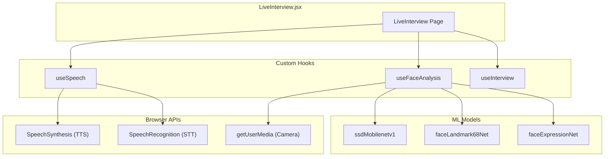

**`useSpeech` Hook** — Manages the voice interaction loop:
- **TTS (Text-to-Speech)**: `speak(text, onEndCallback)` — Uses `SpeechSynthesisUtterance` to read questions aloud. Tracks `isAITalking` state.
- **STT (Speech-to-Text)**: `startListening()` / `stopListening()` — Uses `webkitSpeechRecognition` with `continuous: true` and `interimResults: true`.
- **Interruption Logic**: If the user speaks 4+ words while AI is talking (after 1.5s), `speechSynthesis.cancel()` is called to let the user take over.
- **Manual Input**: `updateTranscriptManually(text)` allows typed answers as a fallback.
- Returns: `{ speak, startListening, stopListening, resetTranscript, updateTranscriptManually, isListening, isAITalking, transcript }`.

### Face Analysis & ML Models

**`useFaceAnalysis` Hook** — Real-time biometric analysis using `face-api.js`:

**Models Loaded** (from `/public/models/`):
- `ssdMobilenetv1` — High-accuracy face detection.
- `faceLandmark68Net` — 68-point facial landmark detection.
- `faceExpressionNet` — Expression classification (happy, sad, neutral, etc.).

**Analysis Pipeline** (runs every 500ms):

| Metric | Method | Threshold |
| :--- | :--- | :--- |
| **Eye Contact** | Nose offset from face center (jaw landmarks) | `< 25px` = looking at screen |
| **Smile Detection** | `expressions.happy` | `> 0.6` = smiling |
| **Dominant Expression** | Highest value in expressions object | — |
| **Confidence Score** | Composite: eye contact (+20/-20), smile (+10), expression (+10/-15) | 0-100 scale |

**EMA Smoothing**: `smoothedScore = 0.65 * previous + 0.35 * rawScore` — Prevents single-frame spikes from blinks or yawns.

**Debounce**: Face must be lost for 6 consecutive frames (~3 seconds) before resetting to "Face not detected" — tolerates brief lighting glitches.

**Output**: `{ analysis: { eyeContact, isSmiling, confidenceScore, dominantExpression }, modelsLoaded }`.

### Styling System

The frontend uses a **glassmorphism design system** implemented in SCSS:

- `style.scss` — Global styles, glassmorphism variables, and base layout.
- `style/button.scss` — Shared button styles.
- Feature-specific SCSS modules in `features/auth/` and `features/interview/style/`.

---

## Caching, Rate Limiting & Security

### Redis Infrastructure

Redis serves three distinct roles in the system:

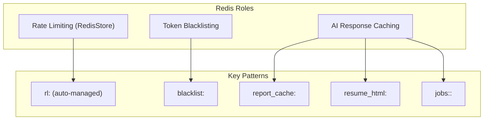

**Redis Client Configuration** (`redis.js`):
- **Reconnect Strategy**: Retries up to 5 times with gradual backoff (`retries * 500ms`, max `2000ms`). Returns `null` after 5 failures to allow the app to proceed without Redis.
- **Keep-Alive**: `pingInterval: 300000` (5 minutes) to prevent idle disconnections.
- **Error Handling**: Suppresses `Socket closed unexpectedly` errors to avoid log spam.

**Cache TTLs:**

| Cache Type | Key Pattern | TTL | Rationale |
| :--- | :--- | :--- | :--- |
| Interview Report | `report_cache:<sha256>` | 24 hours | Same inputs produce same AI output |
| Resume HTML | `resume_html:<sha256>` | 24 hours | AI-generated HTML is expensive; Puppeteer rendering is cheap |
| Job Listings | `jobs:<query>:<location>` | 6 hours | Job listings change slowly |
| Token Blacklist | `blacklist:<token>` | Remaining JWT TTL | Auto-cleanup when token would have expired |

### JWT Authentication & Token Lifecycle

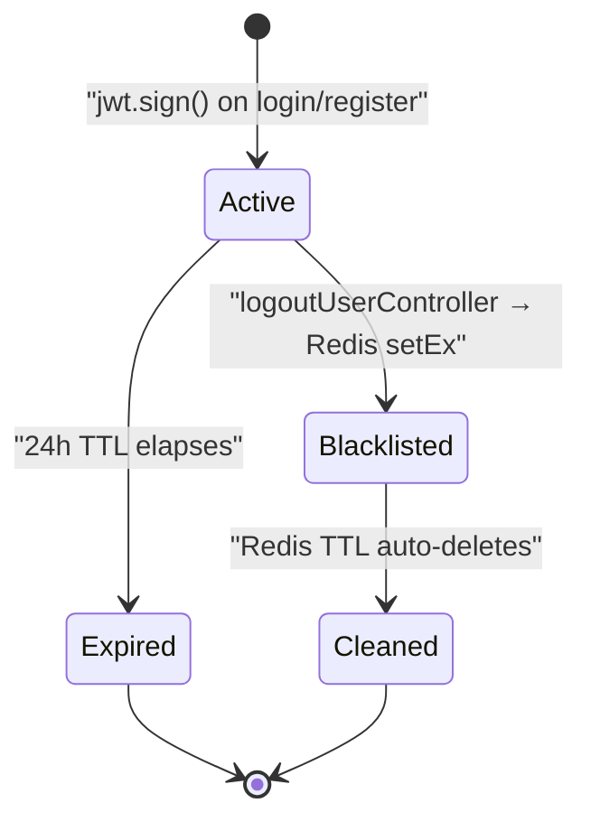

**Token States:**
1. **Active**: Valid JWT, not in Redis blacklist. Passes `authUser` middleware.
2. **Blacklisted**: Token exists in Redis (`blacklist:<token>`). Rejected by `authUser` with "Session expired."
3. **Expired**: JWT's `exp` claim has passed. `jwt.verify()` throws. Rejected by `authUser`.
4. **Cleaned**: Blacklist entry auto-deleted by Redis TTL. No action needed.

### CORS & Network Security

| Security Layer | Implementation | Detail |
| :--- | :--- | :--- |
| **CORS Origin** | Manual middleware in `app.js` | Only allows `FRONTEND_URL` (trailing slash trimmed) |
| **Credentials** | `Access-Control-Allow-Credentials: true` | Required for cross-origin cookie transmission |
| **Preflight** | `OPTIONS` requests return `200` immediately | Prevents browser from blocking actual requests |
| **Trust Proxy** | `app.set("trust proxy", 1)` | Ensures rate limiters use real client IP behind load balancers |
| **Cookie Security** | `httpOnly`, `secure`, `sameSite: "None"` | XSS protection + HTTPS enforcement + cross-domain support |
| **Logout Method** | `POST /api/auth/logout` | Changed from GET to POST to prevent CSRF attacks |
| **File Validation** | Multer: PDF only, 5MB max | Prevents malicious file uploads |
| **Password Policy** | Minimum 8 characters, bcrypt (10 rounds) | Enforced before hashing |

---

## Glossary

| Term | Definition |
| :--- | :--- |
| **AuthProvider** | React Context provider that manages `user` and `loading` state across the application. |
| **InterviewProvider** | React Context provider that manages `report`, `reports`, and `loading` state for interview features. |
| **authUser** | Express middleware that verifies JWTs and checks the Redis blacklist before allowing access to protected routes. |
| **aiRateLimiter** | Express rate limiter (10 req/15 min) applied to AI-intensive routes to prevent abuse and control API costs. |
| **globalBrowser** | Singleton Puppeteer browser instance reused across all PDF generation requests to avoid expensive re-launches. |
| **callAiWithRetry** | Utility function that wraps Gemini API calls with exponential backoff retry logic for 429/quota errors. |
| **generateCacheKey** | Helper that creates SHA-256 hashes of input combinations for deterministic Redis cache keys. |
| **useSpeech** | React hook that wraps the Web Speech API for text-to-speech (TTS) and speech-to-text (STT) with interruption logic. |
| **useFaceAnalysis** | React hook that uses face-api.js (TensorFlow.js) for real-time eye contact, expression, and confidence analysis. |
| **EMA Smoothing** | Exponential Moving Average applied to confidence scores to prevent single-frame spikes from affecting the readout. |
| **RedisStore** | `rate-limit-redis` adapter that allows `express-rate-limit` to share state across multiple server instances. |
| **Zod Schema** | TypeScript-first schema declaration used to validate and type-check AI responses from Gemini. |
| **zodToJsonSchema** | Converter that transforms Zod schemas into JSON Schema format, which is passed to Gemini's `responseSchema` config. |
| **JSearch** | RapidAPI-hosted job search API used to fetch live job listings based on AI-extracted search queries. |
| **Graceful Degradation** | Pattern where AI functions return hardcoded fallback responses when the Gemini API is unavailable (429 errors). |
| **Token Blacklisting** | Security pattern where logged-out JWTs are stored in Redis with a TTL matching their remaining validity period. |

---

<p align="center">
  Built with Google Gemini, React 19, Node.js, MongoDB, Redis, and Puppeteer.
</p>
```

---
