<div align="center">
   
# HirePrep AI
   
**A full-stack AI-powered technical interview preparation platform**

[](LICENSE)
[](https://nodejs.org/)
[](https://react.dev/)
[](https://www.mongodb.com/)
[](https://redis.io/)
[](https://ai.google.dev/)

</div>

---

## Table of Contents

1. [Project Overview](#1-project-overview)
2. [Core Capabilities](#2-core-capabilities)
3. [High-Level Architecture](#3-high-level-architecture)
   - [System Component Map](#31-system-component-map)
   - [Conceptual Data Flow](#32-conceptual-data-flow)
   - [Request Lifecycle](#33-request-lifecycle)
4. [Backend — Express API](#4-backend--express-api)
   - [Startup Sequence](#41-startup-sequence)
   - [Middleware Stack](#42-middleware-stack)
   - [Route Namespaces](#43-route-namespaces)
   - [Controller-Service Pattern](#44-controller-service-pattern)
5. [Authentication System](#5-authentication-system)
   - [JWT Cookie Strategy](#51-jwt-cookie-strategy)
   - [Token Blacklisting (Redis)](#52-token-blacklisting-redis)
   - [Rate Limiting](#53-rate-limiting)
   - [Auth Middleware Flow](#54-auth-middleware-flow)
6. [Interview API](#6-interview-api)
   - [API Endpoints](#61-api-endpoints)
   - [File Handling & PDF Parsing](#62-file-handling--pdf-parsing)
   - [Caching Strategy](#63-caching-strategy)
   - [Controller-to-Service Mapping](#64-controller-to-service-mapping)
7. [AI Service — Google Gemini Integration](#7-ai-service--google-gemini-integration)
   - [Schema Enforcement (Zod)](#71-schema-enforcement-zod)
   - [Exported AI Functions](#72-exported-ai-functions)
   - [Exponential Backoff & Retry](#73-exponential-backoff--retry)
   - [Resume PDF Generation Pipeline](#74-resume-pdf-generation-pipeline)
8. [Job Search API](#8-job-search-api)
   - [Data Flow](#81-data-flow)
   - [Implementation Details](#82-implementation-details)
   - [API Reference](#83-api-reference)
9. [Data Models](#9-data-models)
   - [Entity Relationship Diagram](#91-entity-relationship-diagram)
   - [User Model](#92-user-model)
   - [InterviewReport Model](#93-interviewreport-model)
   - [InterviewSession Model](#94-interviewsession-model)
10. [Middleware & Validation](#10-middleware--validation)
    - [Validator Definitions](#101-validator-definitions)
    - [File Upload Middleware](#102-file-upload-middleware)
    - [Error Handling Architecture](#103-error-handling-architecture)
11. [Frontend — React Application](#11-frontend--react-application)
    - [Provider Hierarchy](#111-provider-hierarchy)
    - [Feature-Based Structure & Path Aliases](#112-feature-based-structure--path-aliases)
    - [Axios API Utility](#113-axios-api-utility)
12. [Routing & Navigation](#12-routing--navigation)
    - [Route Configuration](#121-route-configuration)
    - [Protected Route Guard](#122-protected-route-guard)
    - [Lazy Loading & Error Boundaries](#123-lazy-loading--error-boundaries)
13. [Authentication Feature (Frontend)](#13-authentication-feature-frontend)
    - [AuthContext & useAuth Hook](#131-authcontext--useauth-hook)
    - [Service Layer](#132-service-layer)
14. [Interview Preparation Feature](#14-interview-preparation-feature)
    - [InterviewContext & useInterview Hook](#141-interviewcontext-useinterview-hook)
    - [Interview Report Dashboard](#142-interview-report-dashboard)
    - [Live Interview Session](#143-live-interview-session)
    - [Mock History](#144-mock-history)
15. [Face Analysis & Biometric Subsystem](#15-face-analysis--biometric-subsystem)
    - [Bundled ML Models](#151-bundled-ml-models)
    - [useFaceAnalysis Hook](#152-usefaceanalysis-hook)
    - [Biometric Scoring Weights](#153-biometric-scoring-weights)
    - [Data Flow: Pixels to Metrics](#154-data-flow-pixels-to-metrics)
16. [Infrastructure & Deployment](#16-infrastructure--deployment)
    - [Deployment Architecture](#161-deployment-architecture)
    - [Docker Configuration](#162-docker-configuration)
    - [Redis — Caching & Rate Limiting](#163-redis--caching--rate-limiting)
    - [Frontend Build & Tooling](#164-frontend-build--tooling)
17. [Getting Started — Setup & Configuration](#17-getting-started--setup--configuration)
    - [Environment Variables](#171-environment-variables)
    - [Backend Setup](#172-backend-setup)
    - [Frontend Setup](#173-frontend-setup)
    - [Docker Compose](#174-docker-compose)
18. [Glossary](#18-glossary)

---

## 1. Project Overview

HirePrep AI is a comprehensive full-stack platform designed to automate and enhance technical interview preparation. It leverages **Google Gemini AI** to provide personalized interview reports, real-time mock interview simulations with biometric feedback, and automated resume analysis.

The system is built with a decoupled architecture:
- **Frontend**: React Single Page Application (SPA) powered by Vite
- **Backend**: Node.js/Express REST API
- **Database**: MongoDB (via Mongoose) for persistence
- **Cache**: Redis for caching, rate limiting, and JWT blacklisting

---

## 2. Core Capabilities

HirePrep AI provides three primary functional domains:

| Domain | Description |
|:---|:---|
| **Preparation Engine** | Analyzes user resumes to generate tailored technical and behavioral questions, flashcards, and a customized learning roadmap. |
| **Live Mock Interview** | A real-time simulation environment featuring AI-driven question delivery, speech-to-text processing, and computer-vision based biometric analysis (eye contact and emotion detection). |
| **Career Insights** | Extracts keywords from resumes to fetch live job listings via external APIs and provides automated resume-to-job matching scores. |

---

## 3. High-Level Architecture

### 3.1 System Component Map

```
┌─────────────────────────────────────────────────────────────────┐
│                    Frontend (React SPA)                         │
│  AuthProvider → InterviewProvider → useFaceAnalysis (face-api)  │
│                                   → useSpeech (STT/TTS)         │
└──────────────────────────┬──────────────────────────────────────┘
                           │ REST API (Axios)
┌──────────────────────────▼──────────────────────────────────────┐
│                   Backend (Express API)                         │
│  server.js → auth.routes.js                                     │
│           → interview.routes.js → ai.service.js (Google Gemini) │
│                                 → pdf.service.js (Puppeteer)    │
└──────────────────────────┬──────────────────────────────────────┘
                           │
        ┌──────────────────┴──────────────────┐
        │                                     │
┌───────▼────────┐                  ┌─────────▼──────────┐
│  MongoDB Atlas │                  │  Redis             │
│  (Mongoose)    │                  │  (Cache/Rate-Limit)│
└────────────────┘                  └────────────────────┘
```

### 3.2 Conceptual Data Flow

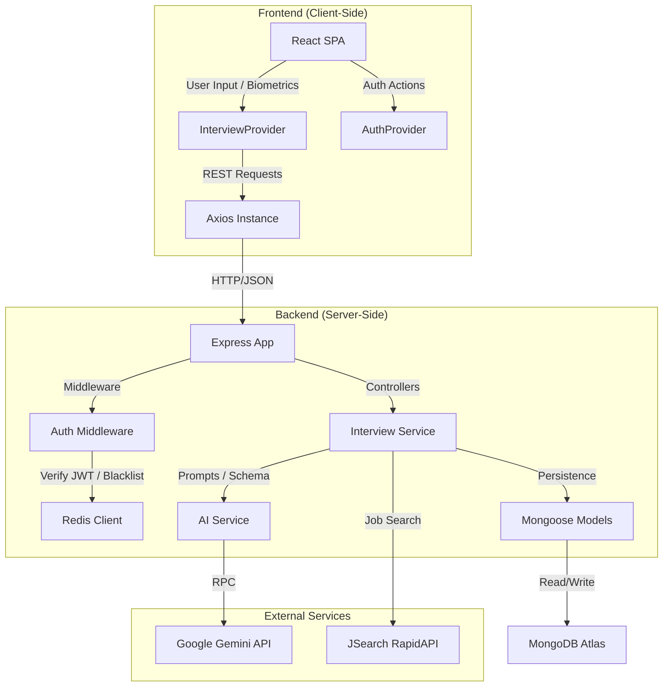
```mermaid
graph TD
    subgraph "Frontend (Client-Side)"
        UI["React SPA"] -- "User Input / Biometrics" --> IP["InterviewProvider"]
        UI -- "Auth Actions" --> AP["AuthProvider"]
        IP -- "REST Requests" --> AX["Axios Instance"]
    end

    subgraph "Backend (Server-Side)"
        AX -- "HTTP/JSON" --> EA["Express App"]
        EA -- "Middleware" --> AM["Auth Middleware"]
        AM -- "Verify JWT / Blacklist" --> RC["Redis Client"]
        EA -- "Controllers" --> IS["Interview Service"]
        IS -- "Prompts / Schema" --> AI["AI Service"]
        IS -- "Persistence" --> MM["Mongoose Models"]
    end

    subgraph "External Services"
        AI -- "RPC" --> GG["Google Gemini API"]
        IS -- "Job Search" --> JS["JSearch RapidAPI"]
    end

    MM -- "Read/Write" --> MDB["MongoDB Atlas"]
```

### 3.3 Request Lifecycle

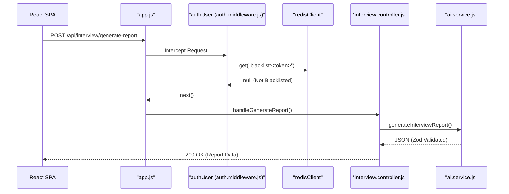
```mermaid
sequenceDiagram
    participant Client as "React SPA"
    participant App as "app.js"
    participant Middleware as "authUser (auth.middleware.js)"
    participant Redis as "redisClient"
    participant Controller as "interview.controller.js"
    participant Service as "ai.service.js"

    Client->>App: POST /api/interview/generate-report
    App->>Middleware: Intercept Request
    Middleware->>Redis: get("blacklist:<token>")
    Redis-->>Middleware: null (Not Blacklisted)
    Middleware->>App: next()
    App->>Controller: handleGenerateReport()
    Controller->>Service: generateInterviewReport()
    Service-->>Controller: JSON (Zod Validated)
    Controller-->>Client: 200 OK (Report Data)
```

---

## 4. Backend — Express API

### 4.1 Startup Sequence

The server initialization in `server.js` follows a strict order to ensure all dependencies are ready before accepting traffic:

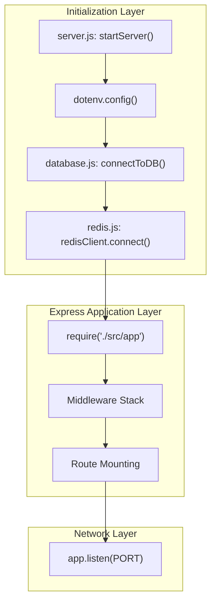
```mermaid
graph TD
    subgraph "Initialization Layer"
        START["server.js: startServer()"] --> DOT["dotenv.config()"]
        DOT --> DB["database.js: connectToDB()"]
        DB --> REDIS["redis.js: redisClient.connect()"]
    end

    subgraph "Express Application Layer"
        REDIS --> APP_REQ["require('./src/app')"]
        APP_REQ --> MW["Middleware Stack"]
        MW --> ROUTES["Route Mounting"]
    end

    subgraph "Network Layer"
        ROUTES --> LISTEN["app.listen(PORT)"]
    end
```

1. **Environment Configuration** — loads variables via `dotenv`
2. **Database Connection** — establishes MongoDB connection; exits with code 1 on failure
3. **Cache Connection** — attempts Redis; logs warning and continues with in-memory fallback on failure
4. **App Initialization** — Express `app` is required *after* connections so middleware can access the Redis client
5. **Listener** — server starts on configured `PORT` (default: 3000)

### 4.2 Middleware Stack

| Middleware | Purpose |
|:---|:---|
| `helmet` | Security headers (XSS, Clickjacking, MIME sniffing protection) |
| Manual CORS | Ensures `Access-Control-Allow-Credentials` and origin matching |
| `express.json` | Parses incoming JSON payloads |
| `cookieParser` | Parses cookies for JWT-based authentication |
| `errorHandler` | Global catch-all for application errors |

### 4.3 Route Namespaces

| Namespace | Description |
|:---|:---|
| `POST /api/auth` | User lifecycle: registration, login, logout |
| `POST /api/interview` | Core engine: report generation, live questions, AI evaluations |
| `GET /api/jobs` | AI-driven job searching via external APIs |

### 4.4 Controller-Service Pattern

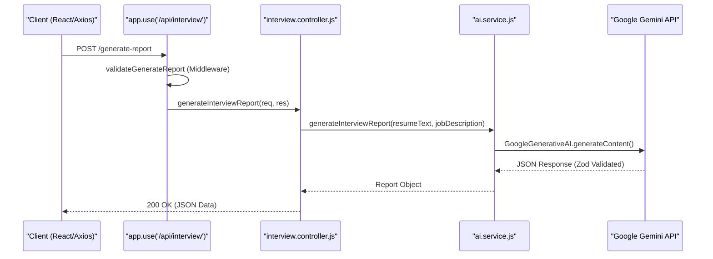
```mermaid
sequenceDiagram
    participant Client as "Client (React/Axios)"
    participant Router as "app.use('/api/interview')"
    participant Controller as "interview.controller.js"
    participant Service as "ai.service.js"
    participant AI as "Google Gemini API"

    Client->>Router: POST /generate-report
    Router->>Router: validateGenerateReport (Middleware)
    Router->>Controller: generateInterviewReport(req, res)
    Controller->>Service: generateInterviewReport(resumeText, jobDescription)
    Service->>AI: GoogleGenerativeAI.generateContent()
    AI-->>Service: JSON Response (Zod Validated)
    Service-->>Controller: Report Object
    Controller-->>Client: 200 OK (JSON Data)
```

---

## 5. Authentication System

The authentication system uses a stateless **JWT-in-Cookie** strategy, enhanced by **Redis** for token revocation and rate limiting.

### 5.1 JWT Cookie Strategy

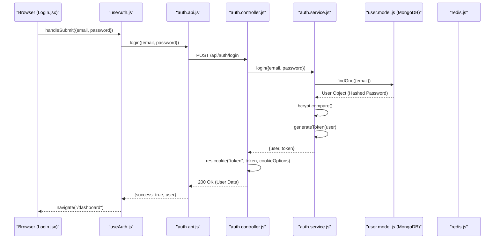
```mermaid
sequenceDiagram
    participant User as "Browser (Login.jsx)"
    participant Hook as "useAuth.js"
    participant API as "auth.api.js"
    participant Ctrl as "auth.controller.js"
    participant Svc as "auth.service.js"
    participant DB as "user.model.js (MongoDB)"
    participant Redis as "redis.js"

    User->>Hook: handleSubmit({email, password})
    Hook->>API: login({email, password})
    API->>Ctrl: POST /api/auth/login
    Ctrl->>Svc: login({email, password})
    Svc->>DB: findOne({email})
    DB-->>Svc: User Object (Hashed Password)
    Svc->>Svc: bcrypt.compare()
    Svc->>Svc: generateToken(user)
    Svc-->>Ctrl: {user, token}
    Ctrl->>Ctrl: res.cookie("token", token, cookieOptions)
    Ctrl-->>API: 200 OK (User Data)
    API-->>Hook: {success: true, user}
    Hook-->>User: navigate("/dashboard")
```

**Cookie Configuration:**

| Property | Value | Reason |
|:---|:---|:---|
| `httpOnly` | `true` | Prevents XSS-based token theft |
| `secure` | `true` | Ensures HTTPS-only transmission |
| `sameSite` | `"None"` | Allows cross-domain cookies (Vercel ↔ Render) |
| Expiry | 1 day | Token TTL |

**Password Security:**
- Passwords are hashed with `bcryptjs` at salt factor 10
- Minimum password length: 8 characters
- Passwords are never stored in plaintext

### 5.2 Token Blacklisting (Redis)

Upon logout, the token's remaining TTL is calculated and stored in Redis with a `blacklist:` prefix. The `authUser` middleware checks `redisClient.isOpen` before querying the blacklist on every protected request.

### 5.3 Rate Limiting

| Feature | Configuration |
|:---|:---|
| Window | 15 Minutes |
| Max Requests | 20 attempts |
| Key Strategy | `x-device-id` header → `req.body.email` → `req.ip` |
| Store | `RedisStore` (falls back to `MemoryStore`) |

### 5.4 Auth Middleware Flow

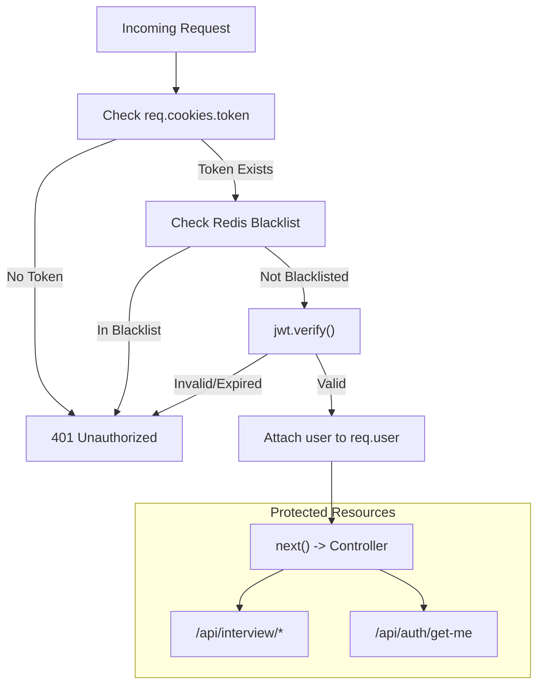
```mermaid
graph TD
    Request["Incoming Request"] --> CookieCheck["Check req.cookies.token"]
    CookieCheck -- "No Token" --> Deny["401 Unauthorized"]
    CookieCheck -- "Token Exists" --> RedisCheck["Check Redis Blacklist"]
    RedisCheck -- "In Blacklist" --> Deny
    RedisCheck -- "Not Blacklisted" --> Verify["jwt.verify()"]
    Verify -- "Invalid/Expired" --> Deny
    Verify -- "Valid" --> AttachUser["Attach user to req.user"]
    AttachUser --> Next["next() -> Controller"]

    subgraph "Protected Resources"
        Next --> InterviewAPI["/api/interview/*"]
        Next --> GetMe["/api/auth/get-me"]
    end
```

---

## 6. Interview API

### 6.1 API Endpoints

**Preparation & Reports**

| Endpoint | Controller | Description |
|:---|:---|:---|
| `POST /generate-report` | `generateInterViewReportController` | Processes resume/job desc to create a prep report |
| `GET /reports` | `getAllInterviewReportsController` | Retrieves all reports for the authenticated user |
| `GET /reports/:interviewId` | `getInterviewReportByIdController` | Fetches a specific report by ID |
| `DELETE /reports/:interviewId` | `deleteInterviewReportController` | Removes a report from the database |
| `GET /resume-pdf/:id` | `generateResumePdfController` | Generates a formatted PDF resume via Puppeteer |

**Live Interview Engine**

| Endpoint | Controller | Description |
|:---|:---|:---|
| `POST /live-questions` | `getLiveQuestionsController` | Generates dynamic questions based on job context |
| `POST /evaluate-answer` | `evaluateSingleAnswerController` | Real-time feedback for a single Q&A pair |
| `POST /hint` | `getLiveHintController` | Generates an AI Copilot hint for the current question |
| `POST /evaluate-session` | `evaluateInterviewController` | Final grading of the full transcript and metrics |
| `GET /sessions` | `getAllInterviewSessionsController` | History of completed mock interviews |

**Learning & Roadmap**

| Endpoint | Controller | Description |
|:---|:---|:---|
| `POST /roadmap` | `generateDynamicRoadmapController` | Generates a day-by-day study plan |

### 6.2 File Handling & PDF Parsing

- `multer` with `memoryStorage` — files stored in RAM as buffers in `req.file`
- **Size limit**: 5 MB
- **MIME type**: `application/pdf` only
- `pdf-parse` extracts raw text from the buffer
- If extracted text is < 50 characters, the file is sent to the AI as Base64-encoded `inlineData`

### 6.3 Caching Strategy

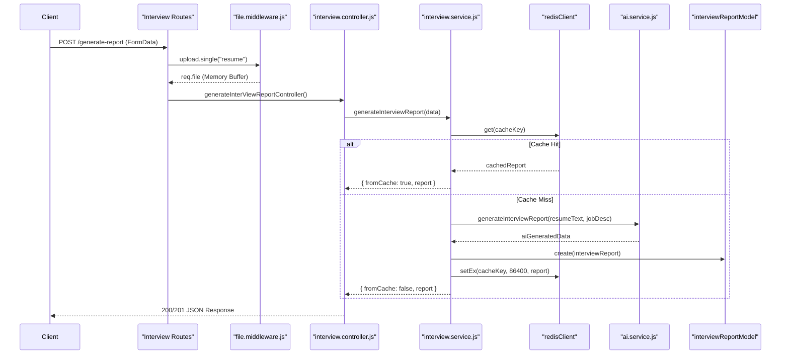
```mermaid
sequenceDiagram
    participant Client
    participant Router as "Interview Routes"
    participant Multer as "file.middleware.js"
    participant Controller as "interview.controller.js"
    participant Service as "interview.service.js"
    participant Redis as "redisClient"
    participant AI as "ai.service.js"
    participant DB as "interviewReportModel"

    Client->>Router: POST /generate-report (FormData)
    Router->>Multer: upload.single("resume")
    Multer-->>Router: req.file (Memory Buffer)
    Router->>Controller: generateInterViewReportController()
    Controller->>Service: generateInterviewReport(data)
    
    Service->>Redis: get(cacheKey)
    alt Cache Hit
        Redis-->>Service: cachedReport
        Service-->>Controller: { fromCache: true, report }
    else Cache Miss
        Service->>AI: generateInterviewReport(resumeText, jobDesc)
        AI-->>Service: aiGeneratedData
        Service->>DB: create(interviewReport)
        Service->>Redis: setEx(cacheKey, 86400, report)
        Service-->>Controller: { fromCache: false, report }
    end
    Controller-->>Client: 200/201 JSON Response
```

Cache key is a SHA-256 hash of `userId + resumeText + jobDescription + selfDescription`. Reports are cached for **24 hours** (86,400 seconds).

### 6.4 Controller-to-Service Mapping

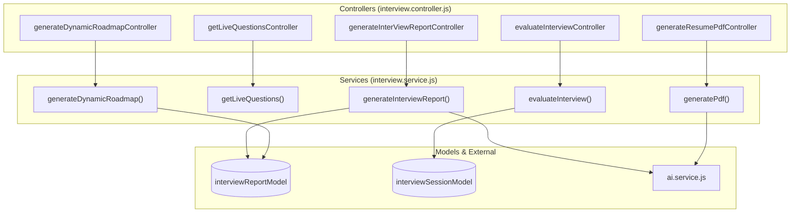
```mermaid
graph TD
    subgraph "Controllers (interview.controller.js)"
        C1["generateInterViewReportController"]
        C2["getLiveQuestionsController"]
        C3["evaluateInterviewController"]
        C4["generateDynamicRoadmapController"]
        C5["generateResumePdfController"]
    end

    subgraph "Services (interview.service.js)"
        S1["generateInterviewReport()"]
        S2["getLiveQuestions()"]
        S3["evaluateInterview()"]
        S4["generateDynamicRoadmap()"]
        S5["generatePdf()"]
    end

    subgraph "Models & External"
        M1[("interviewReportModel")]
        M2[("interviewSessionModel")]
        A1["ai.service.js"]
    end

    C1 --> S1
    C2 --> S2
    C3 --> S3
    C4 --> S4
    C5 --> S5

    S1 --> M1
    S1 --> A1
    S3 --> M2
    S4 --> M1
    S5 --> A1
```

---

## 7. AI Service — Google Gemini Integration

**Model**: `gemini-2.5-flash-lite` via `@google/genai` SDK

### 7.1 Schema Enforcement (Zod)

Every AI function is bound to a Zod schema. Schemas are converted to JSON Schema format and passed to the Gemini API to enforce structured responses, preventing runtime errors from hallucinated or malformed outputs.

| Schema Name | Purpose | Key Fields |
|:---|:---|:---|
| `interviewReportSchema` | Comprehensive prep report | `matchScore`, `technicalQuestions`, `skillGaps`, `preparationPlan` |
| `evaluationSchema` | Live interview grading | `overallScore`, `skills` (confidence/correctness), `questionBreakdown` |
| `liveQuestionsSchema` | Real-time question bank | `questions` (exactly 3 strings) |
| `resumePdfSchema` | AI-enhanced resume | `html` (complete document string) |

### 7.2 Exported AI Functions

| Function | Description |
|:---|:---|
| `generateInterviewReport` | Full analysis: match score, custom questions, skill gaps. Uses SHA-256 cache key to avoid redundant API calls. |
| `generateResumePdf` | Two-stage: Gemini generates Tailwind-styled HTML → Puppeteer renders it to a PDF buffer. |
| `evaluateLiveInterview` | Processes final transcript + biometric metrics (`avgConfidence`, `eyeContactScore`). |
| `generateLiveHint` | AI Copilot: takes current question + partial transcript to provide a subtle hint. |
| `generateDynamicRoadmap` | Generates a day-by-day study plan based on skill gaps and a timeframe (1–30 days). |

### 7.3 Exponential Backoff & Retry

The `callAiWithRetry` function handles `429 Too Many Requests` from the Gemini API:

```
waitTime = Math.pow(2, retryCount) * 1000 + Math.random() * 1000
```

- **Max retries**: 3 attempts
- **Trigger**: HTTP `429` or "quota" error messages
- **Jitter**: Random component prevents synchronized retry spikes

### 7.4 Resume PDF Generation Pipeline

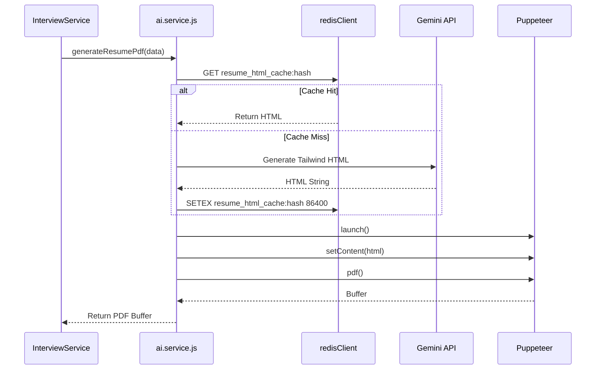
```mermaid
sequenceDiagram
    participant IS as InterviewService
    participant AS as ai.service.js
    participant R as redisClient
    participant G as Gemini API
    participant P as Puppeteer

    IS->>AS: generateResumePdf(data)
    AS->>R: GET resume_html_cache:hash
    alt Cache Hit
        R-->>AS: Return HTML
    else Cache Miss
        AS->>G: Generate Tailwind HTML
        G-->>AS: HTML String
        AS->>R: SETEX resume_html_cache:hash 86400
    end
    AS->>P: launch()
    AS->>P: setContent(html)
    AS->>P: pdf()
    P-->>AS: Buffer
    AS-->>IS: Return PDF Buffer
```

- **Cache key**: `resume_html_cache:[sha256_hash]`
- **TTL**: 24 hours (86,400 seconds)
- Puppeteer rendering is CPU-intensive; caching the HTML avoids re-running AI generation

---

## 8. Job Search API

### 8.1 Data Flow

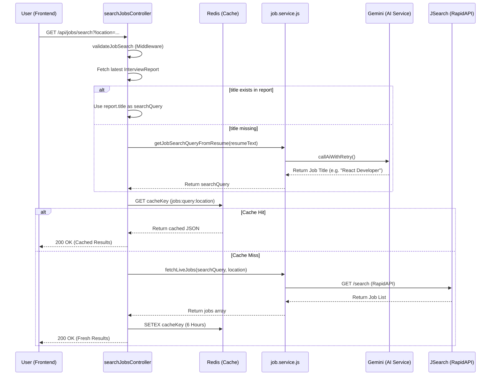
```mermaid
sequenceDiagram
    participant U as User (Frontend)
    participant C as searchJobsController
    participant R as Redis (Cache)
    participant S as job.service.js
    participant AI as Gemini (AI Service)
    participant J as JSearch (RapidAPI)

    U->>C: GET /api/jobs/search?location=...
    C->>C: validateJobSearch (Middleware)
    C->>C: Fetch latest InterviewReport
    alt title exists in report
        C->>C: Use report.title as searchQuery
    else title missing
        C->>S: getJobSearchQueryFromResume(resumeText)
        S->>AI: callAiWithRetry()
        AI-->>S: Return Job Title (e.g. "React Developer")
        S-->>C: Return searchQuery
    end
    
    C->>R: GET cacheKey (jobs:query:location)
    alt Cache Hit
        R-->>C: Return cached JSON
        C-->>U: 200 OK (Cached Results)
    else Cache Miss
        C->>S: fetchLiveJobs(searchQuery, location)
        S->>J: GET /search (RapidAPI)
        J-->>S: Return Job List
        S-->>C: Return jobs array
        C->>R: SETEX cacheKey (6 Hours)
        C-->>U: 200 OK (Fresh Results)
    end
```

### 8.2 Implementation Details

- **AI Query Extraction**: Uses `gemini-2.5-flash-lite` to extract a clean job title from resume text. Fallback: `"Software Engineer"` if extraction fails.
- **External API**: JSearch on RapidAPI (`https://jsearch.p.rapidapi.com/search`), `num_pages: '1'` for speed.
- **Cache key format**: `jobs:{query}:{location}` (lowercased, spaces replaced with underscores)
- **Cache TTL**: 6 hours (21,600 seconds)
- **Rate limit**: 10 requests / 15 minutes per IP

### 8.3 API Reference

**`GET /api/jobs/search`**

| Parameter | Type | Required | Description |
|:---|:---|:---|:---|
| `location` | String (query) | Yes | City or country (2–100 chars) |

**Response (200 OK):**
```json
{
  "message": "Jobs fetched successfully",
  "searchQuery": "Frontend Developer",
  "jobs": [
    {
      "job_id": "...",
      "employer_name": "Tech Corp",
      "job_title": "Senior Frontend Developer",
      "job_apply_link": "..."
    }
  ]
}
```

**Error Responses:**
- `400` — Missing or invalid `location`
- `404` — No `InterviewReport` found (resume data missing)
- `429` — Exceeded 10 requests/15 min limit

---

## 9. Data Models

### 9.1 Entity Relationship Diagram

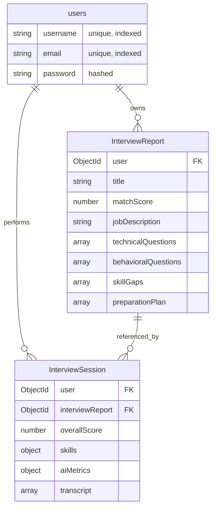
```mermaid
erDiagram
    "users" ||--o{ "InterviewReport" : "owns"
    "users" ||--o{ "InterviewSession" : "performs"
    "InterviewReport" ||--o{ "InterviewSession" : "referenced_by"

    "users" {
        string username "unique, indexed"
        string email "unique, indexed"
        string password "hashed"
    }

    "InterviewReport" {
        ObjectId user "FK"
        string title
        number matchScore
        string jobDescription
        array technicalQuestions
        array behavioralQuestions
        array skillGaps
        array preparationPlan
    }

    "InterviewSession" {
        ObjectId user "FK"
        ObjectId interviewReport "FK"
        number overallScore
        object skills
        object aiMetrics
        array transcript
    }
```

### 9.2 User Model

| Field | Type | Description |
|:---|:---|:---|
| `username` | String | Unique identifier; auto-indexed |
| `email` | String | Unique email; auto-indexed |
| `password` | String | bcrypt-hashed password |

### 9.3 InterviewReport Model

**Sub-schemas** (no `_id`):
- `technicalQuestionSchema` — `question`, `intention`, `answer`
- `behavioralQuestionSchema` — same structure, soft-skills focused
- `skillGapSchema` — `skill`, `severity` (`low` | `medium` | `high`)
- `preparationPlanSchema` — `focus`, `tasks[]` per day

**Main schema fields:**

| Field | Type | Details |
|:---|:---|:---|
| `user` | ObjectId | Reference to `users` collection |
| `matchScore` | Number | 0–100 resume/JD alignment score |
| `detectedSkills` | Array[String] | Skills extracted from resume |
| `title` | String | Job title being prepared for |
| `technicalQuestions` | Array | AI-generated technical Q&A |
| `behavioralQuestions` | Array | AI-generated behavioral Q&A |
| `skillGaps` | Array | Identified gaps with severity |
| `preparationPlan` | Array | Day-by-day study plan |

Uses `{ timestamps: true }` for automatic `createdAt`/`updatedAt`.

### 9.4 InterviewSession Model

| Field | Type | Details |
|:---|:---|:---|
| `user` | ObjectId | Reference to `users` |
| `interviewReport` | ObjectId | Reference to `InterviewReport` |
| `overallScore` | Number | Final session score |
| `skills` | Object | `confidence`, `communication`, `correctness` |
| `aiMetrics` | Object | `avgConfidence`, `eyeContactScore` (biometric) |
| `transcript` | Array | `{ question, answer, feedback }` per turn |
| `summary` | String | AI-generated session summary |

Uses `{ timestamps: true }`.

---

## 10. Middleware & Validation

### 10.1 Validator Definitions

All routes use `express-validator` chains that terminate with `handleValidationErrors`. On failure, returns `400 Bad Request` with the first error message.

| Validator | Scope | Key Constraints |
|:---|:---|:---|
| `validateRegister` | Registration | Username (3–30 chars, alphanumeric), Email (valid), Password (min 8) |
| `validateLogin` | Login | Email (required, normalized), Password (required) |
| `validateGenerateReport` | Interview Prep | Job Description (5–10,000 chars), Self Description (max 2,000) |
| `validateLiveQuestions` | AI Interview | Job Description, Interview Type (enum), User Command |
| `validateEvaluateInterview` | AI Grading | Transcript (non-empty array), items with question/answer strings |
| `validateEvaluateSingleAnswer` | Live Feedback | Question (max 1k), Answer (max 5k), Job Description |
| `validateLiveHint` | AI Copilot | Question (required), Job Description (required) |
| `validateDynamicRoadmap` | Roadmap Gen | Job Description, Days (integer 1–30) |
| `validateJobSearch` | Job API | Location (query param, 2–100 chars) |
| `validateMongoId` | URL Params | Valid MongoDB ObjectId |

### 10.2 File Upload Middleware

- **Storage**: `multer` with `memoryStorage` (files in RAM, not disk)
- **Size limit**: 5 MB
- **MIME type**: `application/pdf` only — any other type triggers an immediate error

### 10.3 Error Handling Architecture

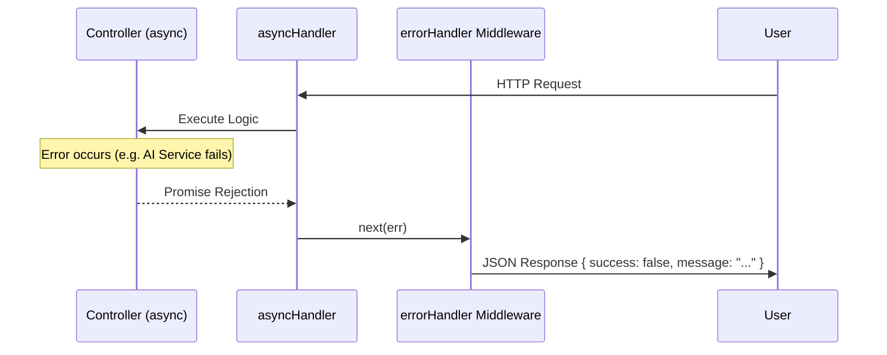
```mermaid
sequenceDiagram
    participant C as Controller (async)
    participant AH as asyncHandler
    participant GEH as errorHandler Middleware
    participant U as User

    U->>AH: HTTP Request
    AH->>C: Execute Logic
    Note over C: Error occurs (e.g. AI Service fails)
    C-->>AH: Promise Rejection
    AH->>GEH: next(err)
    GEH->>U: JSON Response { success: false, message: "..." }
```

- **`asyncHandler`**: Wraps async controllers; catches rejected promises and passes to `next()`
- **`errorHandler`**: Global middleware; defaults to status `500`
- **Environment sensitivity**: In `development`, includes full stack trace; in `production`, suppresses it

---

## 11. Frontend — React Application

### 11.1 Provider Hierarchy

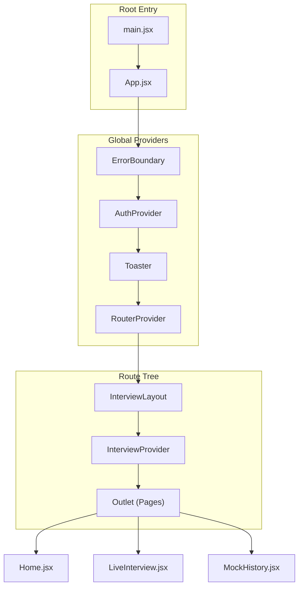
```mermaid
graph TD
    subgraph "Root Entry"
        MAIN["main.jsx"] --> APP["App.jsx"]
    end

    subgraph "Global Providers"
        APP --> EB["ErrorBoundary"]
        EB --> AP["AuthProvider"]
        AP --> TOAST["Toaster"]
        TOAST --> RP["RouterProvider"]
    end

    subgraph "Route Tree"
        RP --> LAYOUT["InterviewLayout"]
        LAYOUT --> IP["InterviewProvider"]
        IP --> OUTLET["Outlet (Pages)"]
    end

    OUTLET --> HOME["Home.jsx"]
    OUTLET --> LIVE["LiveInterview.jsx"]
    OUTLET --> HIST["MockHistory.jsx"]
```

### 11.2 Feature-Based Structure & Path Aliases

```
Frontend/src/
├── features/
│   ├── auth/           # Login, Register, AuthContext, useAuth
│   └── interview/      # Home, Interview, LiveInterview, MockHistory
├── components/         # Shared UI components
├── utils/              # api.js (Axios), helpers
└── assets/             # SCSS styles, static files
```

| Alias | Target | Purpose |
|:---|:---|:---|
| `@` | `src/` | Root source directory |
| `@features` | `src/features/` | Feature modules |
| `@components` | `src/components/` | Shared UI components |
| `@utils` | `src/utils/` | Utility functions and API clients |
| `@assets` | `src/assets/` | Global styles and static assets |

### 11.3 Axios API Utility

Defined in `src/utils/api.js`:
- **Base URL**: `VITE_API_URL` environment variable
- **Credentials**: `withCredentials: true` for JWT cookies
- **Global interceptor**: Automatically handles `401 Unauthorized` by redirecting to `/login` (unless on a public route)

---

## 12. Routing & Navigation

### 12.1 Route Configuration

| Path | Component | Access |
|:---|:---|:---|
| `/` | `Landing.jsx` | Public |
| `/login` | `Login.jsx` | Public |
| `/register` | `Register.jsx` | Public |
| `/dashboard` | `Home.jsx` | Protected |
| `/history` | `MockHistory.jsx` | Protected |
| `/interview/:interviewId` | `Interview.jsx` | Protected |
| `/interview/:interviewId/live` | `LiveInterview.jsx` | Protected |
| `*` | Redirect to `/` | Catch-all |

### 12.2 Protected Route Guard

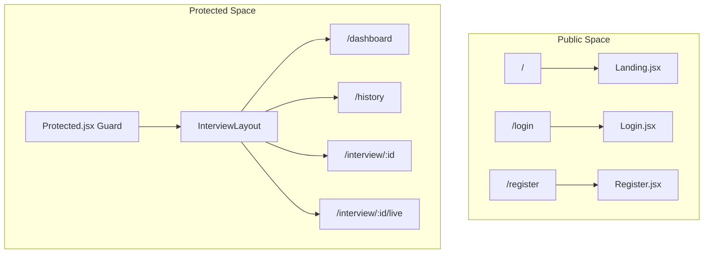
```mermaid
graph TD
    subgraph "Public Space"
        R_ROOT["/"] --> Landing["Landing.jsx"]
        R_LOGIN["/login"] --> Login["Login.jsx"]
        R_REG["/register"] --> Register["Register.jsx"]
    end

    subgraph "Protected Space"
        GUARD["Protected.jsx Guard"] --> LAYOUT["InterviewLayout"]
        LAYOUT --> R_DASH["/dashboard"]
        LAYOUT --> R_HIST["/history"]
        LAYOUT --> R_INT["/interview/:id"]
        LAYOUT --> R_LIVE["/interview/:id/live"]
    end
```

The `Protected` component:
1. **Loading**: Shows full-screen spinner while `useAuth` fetches session
2. **Unauthenticated**: Redirects to `/login` via `Navigate`
3. **Authenticated**: Renders `children`

### 12.3 Lazy Loading & Error Boundaries

- All major pages use `React.lazy()` + `Suspense` for code-splitting
- `PageLoader` spinner shown during chunk loading
- `RouteErrorBoundary` attached to root route via `errorElement` — catches routing failures and lazy-load errors
- Wildcard `*` route redirects undefined URLs to landing page

---

## 13. Authentication Feature (Frontend)

### 13.1 AuthContext & useAuth Hook

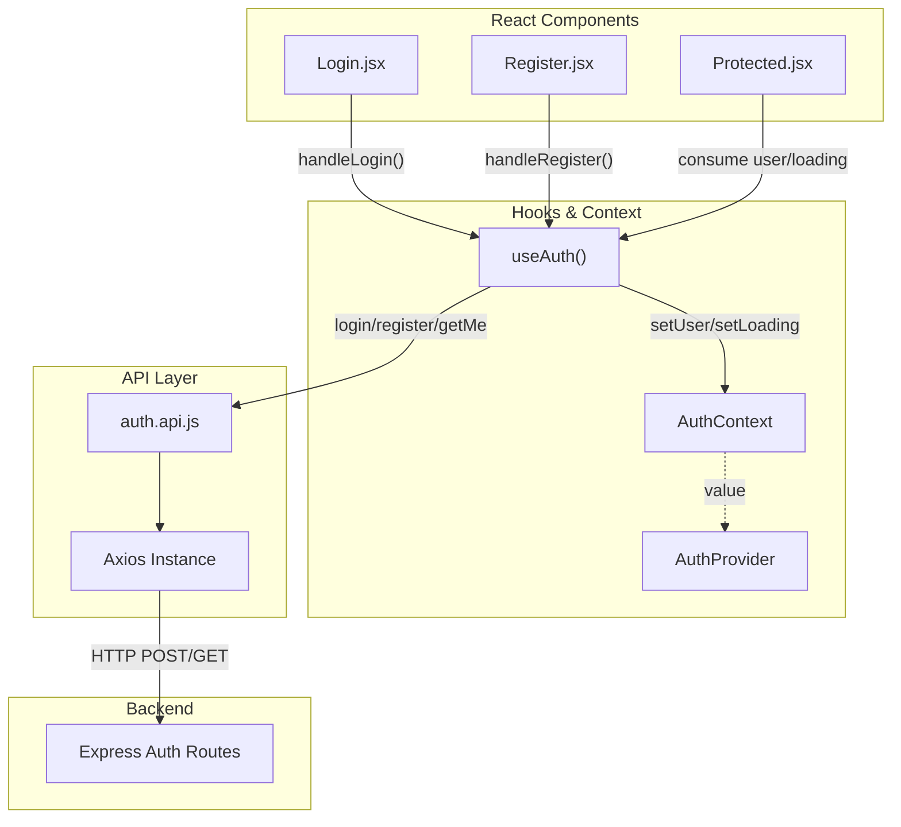
```mermaid
graph TD
    subgraph "React Components"
        Login["Login.jsx"]
        Register["Register.jsx"]
        Prot["Protected.jsx"]
    end

    subgraph "Hooks & Context"
        UA["useAuth()"]
        AC["AuthContext"]
        AP["AuthProvider"]
    end

    subgraph "API Layer"
        AA["auth.api.js"]
        AX["Axios Instance"]
    end

    subgraph "Backend"
        BE["Express Auth Routes"]
    end

    Login -->|"handleLogin()"| UA
    Register -->|"handleRegister()"| UA
    UA -->|"setUser/setLoading"| AC
    AC -.->|"value"| AP
    UA -->|"login/register/getMe"| AA
    AA --> AX
    AX -->|"HTTP POST/GET"| BE
    Prot -->|"consume user/loading"| UA
```

**Key `useAuth` methods:**

| Method | Description |
|:---|:---|
| `handleLogin` | Calls login API, updates global `user` state |
| `handleRegister` | Handles user creation, sets initial session |
| `handleLogout` | Clears local state, notifies backend to blacklist token |
| `getAndSetUser` | Runs on mount via `useEffect`; fetches user via `get-me` for session persistence across refreshes |

### 13.2 Service Layer

| Function | Method | Endpoint |
|:---|:---|:---|
| `register` | `POST` | `/api/auth/register` |
| `login` | `POST` | `/api/auth/login` |
| `logout` | `POST` | `/api/auth/logout` |
| `getMe` | `GET` | `/api/auth/get-me` |

**UI Styling**: Glassmorphism aesthetic — `backdrop-filter: blur(16px)`, semi-transparent backgrounds, `max-width: 400px` centered form.

---

## 14. Interview Preparation Feature

### 14.1 InterviewContext & useInterview Hook

The `InterviewProvider` manages the global state for the current active `report` and the list of all user `reports`.

| Hook Method | API Endpoint |
|:---|:---|
| `generateReport` | `POST /api/interview/` |
| `getReportById` | `GET /api/interview/report/:id` |
| `getReports` | `GET /api/interview/` |
| `getResumePdf` | `POST /api/interview/resume/pdf/:id` |

### 14.2 Interview Report Dashboard

The `Interview.jsx` page is a three-column layout with five preparation modules:

**Match Score Widget:**
- SVG circular progress bar with `strokeDashoffset` animation
- Color thresholds: ≥80 = Green (strong match), ≥50 = Yellow (good potential), <50 = Red (needs improvement)

**Preparation Modules (navigated via `NAV_ITEMS` sidebar):**

| Module | Description |
|:---|:---|
| Technical Questions | Accordion cards with `question`, `intention`, and model `answer` |
| Behavioral Questions | Same structure, soft-skills focused |
| Flashcard Bank | 3D tilt effect on mouse move; filter by All/Technical/Behavioral |
| Roadmap Section | Day-by-day plan; adjustable 1–30 days; "Regenerate Plan" calls AI |
| Job Search Section | AI-extracted job title + user-provided location → live JSearch results |

**Resume PDF Pipeline:**
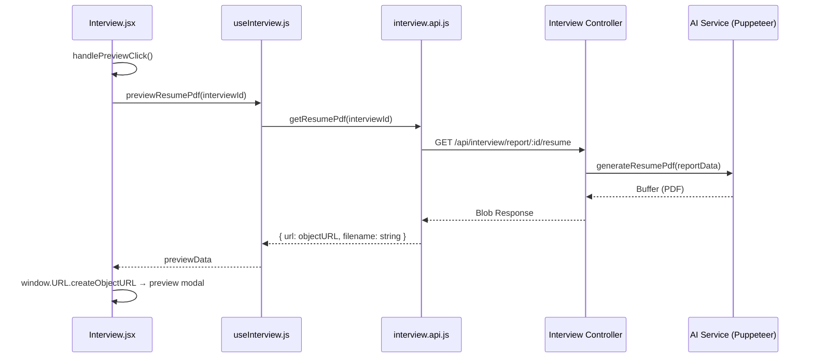
```mermaid
sequenceDiagram
    participant UI as Interview.jsx
    participant Hook as useInterview.js
    participant API as interview.api.js
    participant BE as Interview Controller
    participant AI as AI Service (Puppeteer)

    UI->>UI: handlePreviewClick()
    UI->>Hook: previewResumePdf(interviewId)
    Hook->>API: getResumePdf(interviewId)
    API->>BE: GET /api/interview/report/:id/resume
    BE->>AI: generateResumePdf(reportData)
    AI-->>BE: Buffer (PDF)
    BE-->>API: Blob Response
    API-->>Hook: { url: objectURL, filename: string }
    Hook-->>UI: previewData
    UI->>UI: window.URL.createObjectURL → preview modal
```

### 14.3 Live Interview Session

The live session operates as a **3-step state machine** in `LiveInterview.jsx`:

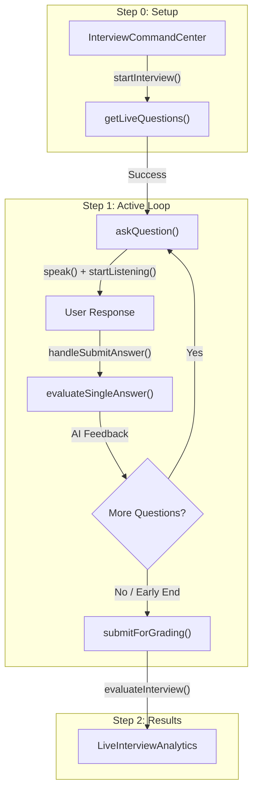
```mermaid
graph TD
    subgraph "Step 0: Setup"
        A["InterviewCommandCenter"] -- "startInterview()" --> B["getLiveQuestions()"]
    end

    subgraph "Step 1: Active Loop"
        B -- "Success" --> C["askQuestion()"]
        C -- "speak() + startListening()" --> D["User Response"]
        D -- "handleSubmitAnswer()" --> E["evaluateSingleAnswer()"]
        E -- "AI Feedback" --> F{"More Questions?"}
        F -- "Yes" --> C
        F -- "No / Early End" --> G["submitForGrading()"]
    end

    subgraph "Step 2: Results"
        G -- "evaluateInterview()" --> H["LiveInterviewAnalytics"]
    end
```

**Core Components:**

| Component | Role |
|:---|:---|
| `InterviewCommandCenter` | Configuration: interview type, user command, resume insights |
| `LiveCameraPanel` | Video feed, AI avatar, real-time biometric feedback display |
| `TranscriptChat` | Q&A display, manual text input, AI Copilot hint button |
| `LiveInterviewAnalytics` | Post-interview: overall score, skill bars, Q&A breakdown, PDF export |

**Speech Services (`useSpeech` hook):**

| Feature | Implementation |
|:---|:---|
| STT | `window.SpeechRecognition` — continuous listening with interim results |
| TTS | `window.speechSynthesis` — AI narrates questions and feedback |
| Interruption | If user speaks ≥4 words while AI talks for >1.5s, `speechSynthesis.cancel()` is called |

**Biometric Aggregation on Submit:**
- `avgConfidence` = `confidenceHistory.reduce((a,b) => a+b, 0) / confidenceHistory.length`
- `eyeContactScore` = percentage of frames where eye contact was maintained

### 14.4 Mock History

The `MockHistory` page aggregates completed session data:

| Entity | Description |
|:---|:---|
| Quick Stats | Total interviews and average score |
| Progress Chart | `recharts` `LineChart` of `overallScore` over time |
| Session Cards | Individual summaries with skill pills, score badge, date |
| Mouse Tooltip | Hover tooltip showing full AI-generated session summary |

**Layout**: Two-column grid on desktop (400px sidebar + 1fr content), collapses to single column on mobile.

---

## 15. Face Analysis & Biometric Subsystem

All computer vision runs **client-side** using `face-api.js` + TensorFlow.js (WebGL). No video frames are sent to the server.

### 15.1 Bundled ML Models

Located in `Frontend/public/models/`:

| Model | Purpose |
|:---|:---|
| **SSD MobileNet v1** | Primary face detector (CNN with MobileNet backbone) |
| **Face Landmark 68** | 68-point landmark predictor for head orientation |
| **Face Expression** | Classifies 7 emotions: neutral, happy, sad, angry, fearful, disgusted, surprised |
| **Tiny Face Detector** | Lightweight alternative for lower-end devices |

Models are lazy-loaded only when the user enables the camera. After first fetch, TensorFlow.js stores them in browser `IndexedDB` for instant subsequent loads.

### 15.2 useFaceAnalysis Hook

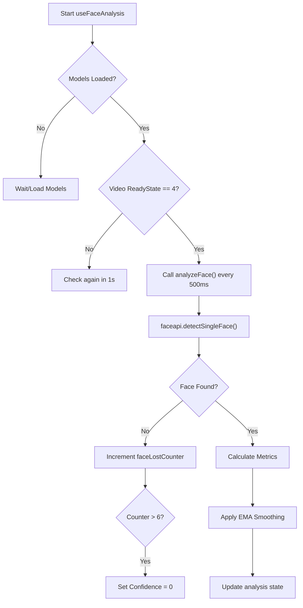
```mermaid
graph TD
    A["Start useFaceAnalysis"] --> B{"Models Loaded?"}
    B -- No --> C["Wait/Load Models"]
    B -- Yes --> D{"Video ReadyState == 4?"}
    D -- No --> E["Check again in 1s"]
    D -- Yes --> F["Call analyzeFace() every 500ms"]
    F --> G["faceapi.detectSingleFace()"]
    G --> H{"Face Found?"}
    H -- No --> I["Increment faceLostCounter"]
    I --> J{"Counter > 6?"}
    J -- Yes --> K["Set Confidence = 0"]
    H -- Yes --> L["Calculate Metrics"]
    L --> M["Apply EMA Smoothing"]
    M --> N["Update analysis state"]
```

**Heuristics:**

| Heuristic | Logic |
|:---|:---|
| Eye Contact | `noseOffset < 25px` from jaw center = looking at screen |
| Expression Bias Correction | Forces non-neutral if any emotion probability > 0.25 |
| Confidence Smoothing (EMA) | `new = 0.65 * prev + 0.35 * raw` (alpha = 0.65) |
| Debounced Face Loss | Waits 6 consecutive missed frames (~3s) before declaring face "lost" |

**Analysis interval**: 500ms | **Min detection confidence**: 0.1

**Returned state object:**
```javascript
{
  eyeContact: boolean,         // Current frame eye contact status
  isSmiling: boolean,          // Current frame smile status
  confidenceScore: number,     // EMA-smoothed behavioral score (0-100)
  dominantExpression: string   // Current detected emotion
}
```

### 15.3 Biometric Scoring Weights

| Condition | Score Impact |
|:---|:---|
| Eye Contact Detected | +20 |
| Eye Contact Lost | -20 |
| Smiling (Happy > 0.4) | +10 |
| Neutral/Happy Expression | +10 |
| Surprised Expression | -5 |
| Sad/Fearful Expression | -15 |

Base score starts at 50. Final score is EMA-smoothed.

### 15.4 Data Flow: Pixels to Metrics

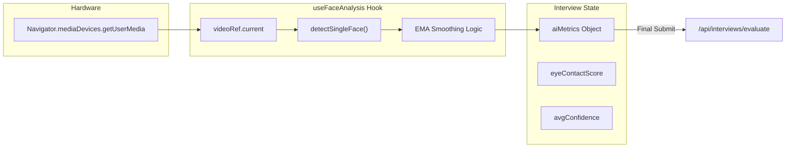
```mermaid
graph LR
    subgraph "Hardware"
        CAM["Navigator.mediaDevices.getUserMedia"]
    end

    subgraph "useFaceAnalysis Hook"
        VREF["videoRef.current"]
        DET["detectSingleFace()"]
        SMOOTH["EMA Smoothing Logic"]
    end

    subgraph "Interview State"
        METRICS["aiMetrics Object"]
        EYE["eyeContactScore"]
        CONF["avgConfidence"]
    end

    CAM --> VREF
    VREF --> DET
    DET --> SMOOTH
    SMOOTH --> METRICS
    METRICS -- "Final Submit" --> BACKEND["/api/interviews/evaluate"]
```

---

## 16. Infrastructure & Deployment

### 16.1 Deployment Architecture

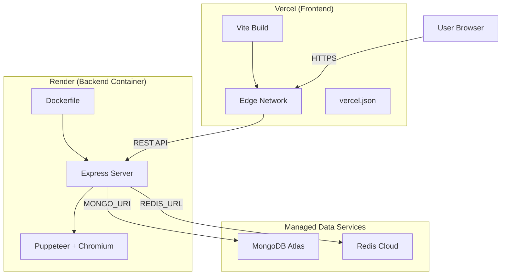
```mermaid
graph TD
    subgraph "Vercel (Frontend)"
        VB["Vite Build"] --> EN["Edge Network"]
        VJ["vercel.json"]
    end

    subgraph "Render (Backend Container)"
        DF["Dockerfile"] --> ES["Express Server"]
        ES --> PC["Puppeteer + Chromium"]
    end

    subgraph "Managed Data Services"
        ES -- "MONGO_URI" --> MA["MongoDB Atlas"]
        ES -- "REDIS_URL" --> RC["Redis Cloud"]
    end

    UB["User Browser"] -- "HTTPS" --> EN
    EN -- "REST API" --> ES
```

| Service | Platform | Notes |
|:---|:---|:---|
| Frontend | Vercel | Static SPA, Edge delivery, `vercel.json` config |
| Backend | Render | Containerized via `Dockerfile`, Chromium for Puppeteer |
| Database | MongoDB Atlas | Managed cloud MongoDB |
| Cache | Redis Cloud | Managed Redis instance |

### 16.2 Docker Configuration

**`Backend/Dockerfile`** uses `node:22-alpine`:
- Installs native Alpine Chromium + font libraries for Puppeteer
- `PUPPETEER_SKIP_DOWNLOAD=true` — prevents redundant binary download
- `PUPPETEER_EXECUTABLE_PATH=/usr/bin/chromium-browser`
- `NODE_ENV=production`, `npm ci --omit=dev` for minimal image size
- Runs under non-root `node` user for security

**`Backend/docker-compose.yml`** services:
- `backend` — builds from local `Dockerfile`, maps local dir for hot-reload
- `redis` — `redis:alpine` image, aliased as `redis` on Docker network

```bash
# Run full local environment
docker-compose up --build
```

### 16.3 Redis — Caching & Rate Limiting

**Connection resilience:**
- `reconnectStrategy`: up to 5 retries with increasing delays
- `pingInterval`: 5 minutes to maintain long-lived connections
- On failure: falls back to in-memory `MemoryStore` for rate limiting

**Rate Limiting Tiers:**

| Limiter | Scope | Limit | Window | Key Strategy |
|:---|:---|:---|:---|:---|
| Auth Limiter | Register/Login | 20 req | 15 min | `x-device-id` → email → IP |
| AI Limiter | Interview Generation | 1000 req | 15 min | Network IP |
| Job Limiter | JSearch API | 10 req | 15 min | Network IP |

**Caching:**

| Cache | Key Format | TTL |
|:---|:---|:---|
| Interview Report | `report:{sha256_hash}` | 24 hours |
| Resume HTML | `resume_html_cache:{hash}` | 24 hours |
| Job Search Results | `jobs:{query}:{location}` | 6 hours |

**JWT Blacklisting:**
1. User calls `POST /api/auth/logout`
2. Token stored in Redis with TTL = token's remaining life
3. `authUser` middleware checks blacklist on every protected request

### 16.4 Frontend Build & Tooling

**Vite** powers the build pipeline:
- Path aliases configured in `vite.config.js` and mirrored in `jsconfig.json` for IDE IntelliSense
- SCSS modular architecture with CSS custom properties for theming

**Global CSS Variables (`style.scss`):**
```scss
--bg-dark: #09090b;
--accent-gradient: /* emerald gradient */;
```

**Utility Classes:**
- `.glass-panel` — `backdrop-filter: blur(16px)` + semi-transparent border
- `.text-gradient` — `-webkit-background-clip: text` with emerald gradient

**ESLint** (`eslint.config.js`):
- `eslint-plugin-react-hooks` — enforces hook rules
- `eslint-plugin-react-refresh` — ensures Fast Refresh compatibility
- `ecmaVersion: 2020`, `globals.browser`

---

## 17. Getting Started — Setup & Configuration

### 17.1 Environment Variables

**Backend (`Backend/.env`):**

| Variable | Description |
|:---|:---|
| `PORT` | Express server port (default: 3000) |
| `MONGO_URI` | MongoDB connection string |
| `REDIS_URL` | Redis connection string (e.g., `redis://localhost:6379`) |
| `JWT_SECRET` | Secret key for signing JWTs |
| `GEMINI_API_KEY` | Google Gemini AI API key |
| `RAPIDAPI_KEY` | RapidAPI key for JSearch job listings |

**Frontend (`Frontend/.env`):**

| Variable | Description |
|:---|:---|
| `VITE_API_URL` | Backend API base URL |

### 17.2 Backend Setup

```bash
cd Backend
npm install
npm run dev        # Start with nodemon (hot-reload)
```

**Startup dependency chain:**
```
MongoDB connected → Redis connected (or fallback) → Express app loaded → Server listening
```

### 17.3 Frontend Setup

```bash
cd Frontend
npm install
npm run dev        # Vite dev server
npm run build      # Production build → /dist
```

### 17.4 Docker Compose

```bash
# From the Backend/ directory
docker-compose up --build
```

This starts:
- `backend` service on the configured `PORT`
- `redis` service on `redis:6379` (internal Docker network)

**Environment injection**: `REDIS_URL=redis://redis:6379` is automatically set via `docker-compose.yml`.

---

## 18. Glossary

| Term | Definition |
|:---|:---|
| **Interview Report** | AI-generated analysis of a resume vs. job description. Contains match score, questions, skill gaps, and preparation plan. Stored as `InterviewReport` in MongoDB. |
| **Live Interview Session** | Real-time mock interview with STT, TTS, and face analysis. Results stored as `InterviewSession`. |
| **AI Copilot** | Hint system during live interview. Provides subtle, context-aware hints without giving away the full answer. |
| **Dynamic Roadmap** | Personalized day-by-day study plan (1–30 days) generated from identified skill gaps. |
| **EMA** | Exponential Moving Average. Used to smooth `confidenceScore` in face analysis: `0.65 * prev + 0.35 * raw`. |
| **TTS** | Text-to-Speech. `window.speechSynthesis` narrates AI questions and feedback. |
| **STT** | Speech-to-Text. `window.SpeechRecognition` captures user answers. |
| **Zod** | TypeScript-first schema validation library. Used to enforce structured JSON responses from Gemini AI. |
| **Multer** | Node.js middleware for `multipart/form-data`. Handles resume PDF uploads with memory storage. |
| **JWT** | JSON Web Token. Stateless session management via HTTP-only cookies. |
| **Blacklist** | Redis-backed token revocation store. Invalidates JWTs before their natural expiry on logout. |
| **callAiWithRetry** | Wrapper function implementing exponential backoff for Gemini API `429` errors. |
| **asyncHandler** | Express utility that wraps async controllers to forward rejected promises to the global `errorHandler`. |
| **SSD MobileNet v1** | CNN-based face detector used as the primary model in `useFaceAnalysis`. |
| **Face Landmark 68** | 68-point facial landmark model used for eye contact heuristic calculation. |
| **matchScore** | 0–100 score indicating alignment between a user's resume and the target job description. |

---

## License

This project is licensed under the **MIT License** — see the [LICENSE](LICENSE) file for details.
