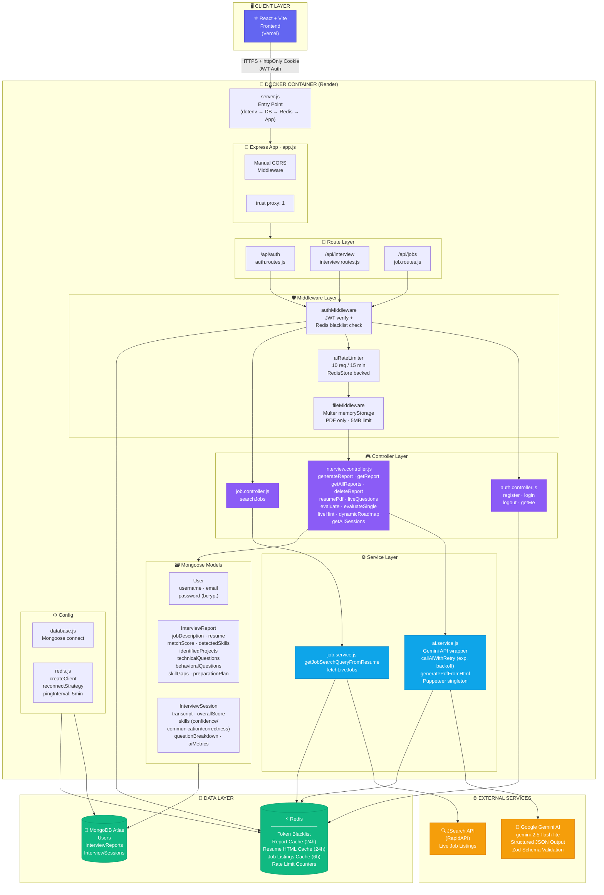
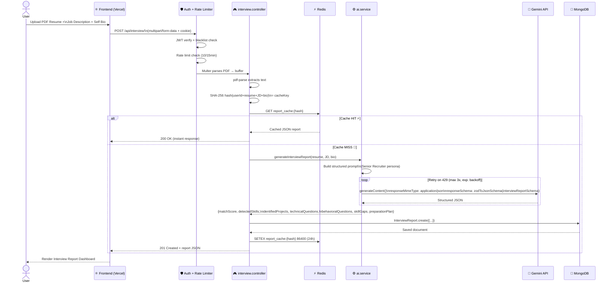
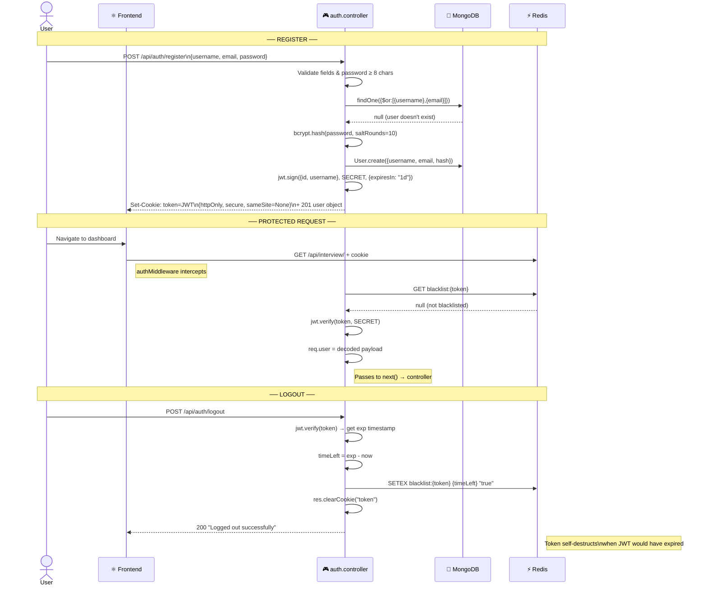
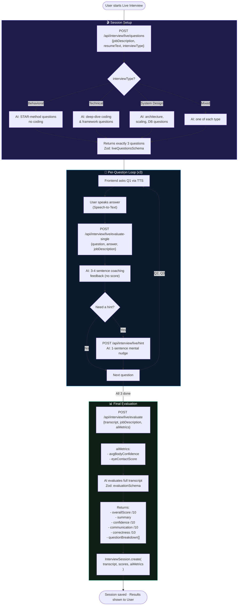
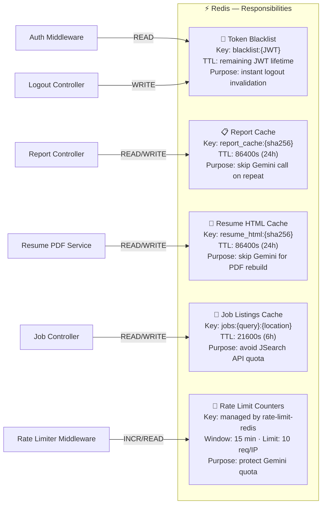
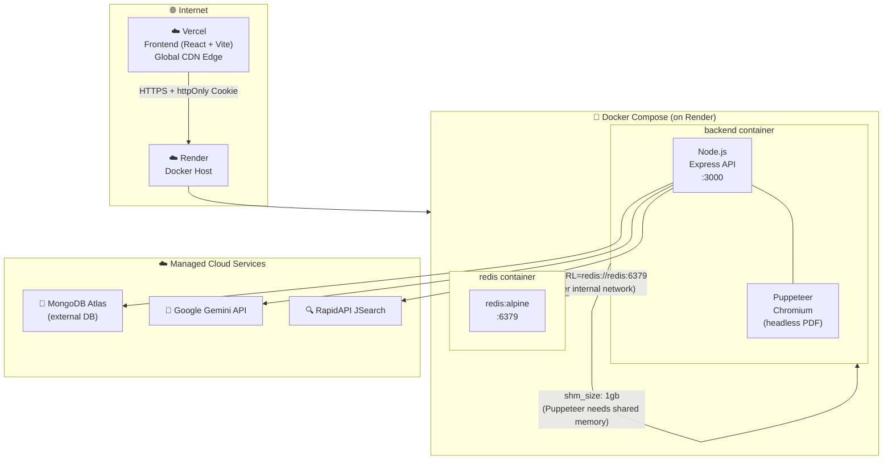

# 🏗️ HirePrep AI — High-Level Architecture

---

## 1. Full System Architecture

---

## 2. Interview Report Generation Flow (with Redis Cache)

---

## 3. Authentication Flow (JWT + Redis Blacklist)

---

## 4. Live Mock Interview Session Flow

---

## 5. Redis Usage Map

---

## 6. Docker Deployment Topology

